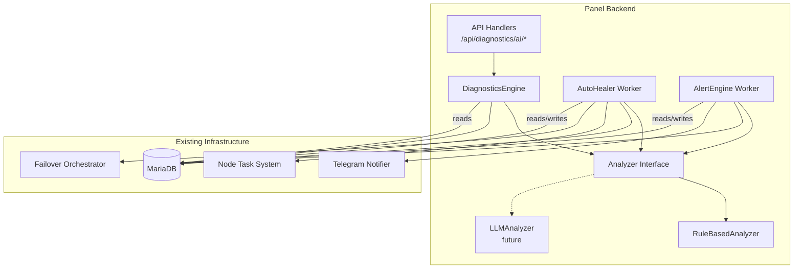
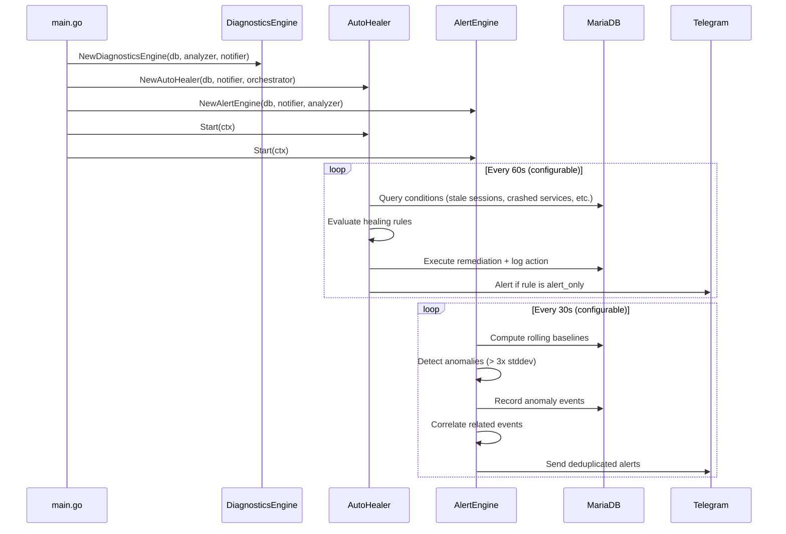

# Design Document: AI Health Monitor

## Overview

The AI Health Monitor is a comprehensive diagnostics, auto-healing, and alerting system for KorisPanel. It operates as a set of background workers and API endpoints that continuously monitor infrastructure health, automatically remediate common issues, and send intelligent alerts via Telegram.

The system is composed of three main subsystems:
1. **Diagnostics Engine** — Runs health checks, computes health scores, and provides an API for on-demand diagnostics
2. **Auto-Healer** — Background worker that detects failure conditions and performs automated remediation
3. **Alert Engine** — Monitors for anomalies, correlates events, deduplicates alerts, and dispatches Telegram notifications

All three subsystems share a common `Analyzer` interface that defaults to rule-based heuristics but can be swapped for an LLM-powered implementation via environment configuration.

## Architecture




### Worker Lifecycle



## Components and Interfaces

### Package Structure

```
panel/internal/health/
├── health.go           // Analyzer interface, types, Health_Score computation
├── diagnostics.go      // DiagnosticsEngine - runs checks, computes scores
├── checks.go           // Individual health check implementations
├── healer.go           // AutoHealer worker
├── alert.go            // AlertEngine worker - anomaly detection, correlation
├── analyzer_rules.go   // RuleBasedAnalyzer implementation
├── analyzer_llm.go     // LLMAnalyzer implementation (future)
├── dedup.go            // Alert deduplication logic
├── reports.go          // Daily/weekly report generation
└── health_test.go      // Tests
```


### Core Interfaces

```go
package health

import "time"

// Analyzer defines the interface for root-cause analysis and suggestion generation.
// The default implementation uses rule-based heuristics. An LLM-backed implementation
// can be swapped in via PANEL_LLM_ENDPOINT environment variable.
type Analyzer interface {
    // Analyze takes structured health data and returns analysis results.
    Analyze(input AnalysisInput) (AnalysisOutput, error)
}

// AnalysisInput is the structured input to the Analyzer.
type AnalysisInput struct {
    CheckResults []CheckResult `json:"check_results"`
    EventHistory []AnomalyEvent `json:"event_history,omitempty"`
}

// AnalysisOutput is the structured output from the Analyzer.
type AnalysisOutput struct {
    RootCause       string   `json:"root_cause"`
    Confidence      float64  `json:"confidence"`      // 0.0 - 1.0
    SuggestedActions []string `json:"suggested_actions"`
    AffectedComponents []string `json:"affected_components"`
}

// Severity represents the health status of a check.
type Severity string

const (
    SeverityHealthy  Severity = "healthy"
    SeverityWarning  Severity = "warning"
    SeverityCritical Severity = "critical"
)

// CheckResult represents the output of a single health check.
type CheckResult struct {
    Name             string   `json:"name"`
    Category         string   `json:"category"`
    Severity         Severity `json:"severity"`
    Message          string   `json:"message"`
    Value            float64  `json:"value,omitempty"`
    Threshold        float64  `json:"threshold,omitempty"`
    SuggestedActions []string `json:"suggested_actions,omitempty"`
    NodeID           *int64   `json:"node_id,omitempty"`
    Metadata         map[string]any `json:"metadata,omitempty"`
}

// HealthReport is the full diagnostics response.
type HealthReport struct {
    Score           int            `json:"score"`      // 0-100
    Trend           string         `json:"trend"`      // "improving", "stable", "degrading"
    Checks          []CheckResult  `json:"checks"`
    RootCauseAnalysis *AnalysisOutput `json:"root_cause_analysis,omitempty"`
    GeneratedAt     time.Time      `json:"generated_at"`
}
```


### DiagnosticsEngine

```go
// DiagnosticsEngine orchestrates health checks and computes scores.
type DiagnosticsEngine struct {
    db       *sql.DB
    analyzer Analyzer
    notifier *notify.Notifier
    checks   []HealthCheck
}

// HealthCheck is a single probe function.
type HealthCheck interface {
    Name() string
    Category() string
    Run(ctx context.Context, db *sql.DB) CheckResult
}

// NewDiagnosticsEngine creates the engine with all registered checks.
func NewDiagnosticsEngine(db *sql.DB, analyzer Analyzer, notifier *notify.Notifier) *DiagnosticsEngine

// RunAll executes all checks and produces a HealthReport.
func (de *DiagnosticsEngine) RunAll(ctx context.Context) (*HealthReport, error)

// ComputeScore calculates a weighted health score from check results.
// Returns a value in [0, 100]. All-healthy = 100, weighted by check category.
func ComputeScore(results []CheckResult, weights map[string]float64) int

// ClassifySeverity assigns severity based on value and thresholds.
// value < warningThreshold → healthy
// warningThreshold <= value < criticalThreshold → warning
// value >= criticalThreshold → critical
func ClassifySeverity(value, warningThreshold, criticalThreshold float64) Severity

// ComputeTrend compares current score to 24h rolling average.
// Returns "improving" if current > avg + 5, "degrading" if current < avg - 5, else "stable".
func ComputeTrend(currentScore int, historicalScores []int) string
```

### Health Checks Implementation

Each check queries existing tables:

| Check | Table(s) Queried | Logic |
|-------|-----------------|-------|
| Database Connectivity | `SELECT 1` | Ping with 5s timeout |
| Node Online Status | `nodes`, `node_status` | Count nodes where `last_seen_at < NOW() - 5min` |
| VPN Service Health | `node_status` | Check `openvpn_status`, `l2tp_status`, `ikev2_status` fields |
| Disk Usage | `node_status` | Check `disk_percent` against thresholds |
| Memory Usage | `node_status` | Check `ram_percent` against thresholds |
| CPU Usage | `node_status` | Check `cpu_percent` against thresholds |
| Stale Sessions | `radacct` | Count sessions with `acctstoptime IS NULL AND acctupdatetime < NOW() - INTERVAL ? MINUTE` |
| Expired Subscriptions | `customers`, `subscriptions` | Count customers with `status='expired'` |
| DNS Failover Status | `failover_events` | Check for recent failed/propagating events |


### AutoHealer

```go
// AutoHealer is a background worker that detects conditions and performs remediation.
type AutoHealer struct {
    db           *sql.DB
    notifier     *notify.Notifier
    orchestrator *api.FailoverOrchestrator
    interval     time.Duration  // default 60s
}

// NewAutoHealer creates the worker with dependencies.
func NewAutoHealer(db *sql.DB, notifier *notify.Notifier, orchestrator *api.FailoverOrchestrator) *AutoHealer

// Start launches the background worker loop.
func (ah *AutoHealer) Start(ctx context.Context)

// Tick performs one cycle of detection and healing.
func (ah *AutoHealer) Tick(ctx context.Context) error

// DetectConditions evaluates all healing rules against current system state.
// Returns a slice of triggered conditions that require action.
func (ah *AutoHealer) DetectConditions(ctx context.Context) ([]TriggeredCondition, error)

// ShouldHeal checks cooldown and rule mode before allowing action.
// Returns false if within cooldown window or rule is disabled.
func (ah *AutoHealer) ShouldHeal(rule HealingRule, resourceID string, now time.Time) bool

// ExecuteAction performs the remediation and logs the result.
func (ah *AutoHealer) ExecuteAction(ctx context.Context, condition TriggeredCondition) error

// TriggeredCondition represents a detected issue ready for remediation.
type TriggeredCondition struct {
    RuleID       string
    ConditionType string
    ResourceType string
    ResourceID   string
    Details      map[string]any
}
```

**Integration with existing systems:**

- **Node Task System**: When a VPN service crash is detected, the healer creates a `node_tasks` row with `action = "restart_service"` and `payload_json = {"service": "openvpn"}`. The node agent picks this up on its next poll cycle (existing flow).
- **Failover Orchestrator**: When a node is offline beyond threshold and has failover domains configured, the healer calls `orchestrator.TriggerFailover()` with `reason = "auto_heal"` and `triggeredBy = "health_monitor"`.


### AlertEngine

```go
// AlertEngine monitors for anomalies, correlates events, and dispatches alerts.
type AlertEngine struct {
    db       *sql.DB
    notifier *notify.Notifier
    analyzer Analyzer
    interval time.Duration  // default 30s
    dedup    *Deduplicator
}

// NewAlertEngine creates the engine.
func NewAlertEngine(db *sql.DB, notifier *notify.Notifier, analyzer Analyzer) *AlertEngine

// Start launches the background worker loop.
func (ae *AlertEngine) Start(ctx context.Context)

// Tick performs one cycle of anomaly detection and alerting.
func (ae *AlertEngine) Tick(ctx context.Context) error

// ComputeBaseline calculates rolling mean and stddev for a metric over a time window.
func ComputeBaseline(values []float64) (mean float64, stddev float64)

// IsAnomaly determines if a value exceeds baseline + multiplier * stddev.
func IsAnomaly(value, mean, stddev, multiplier float64) bool

// CorrelateEvents groups related events within a time window and applies
// correlation rules to identify root causes.
func (ae *AlertEngine) CorrelateEvents(events []AnomalyEvent, window time.Duration) []CorrelatedIncident

// CorrelatedIncident represents a group of related events with analysis.
type CorrelatedIncident struct {
    Events     []AnomalyEvent
    RootCause  string
    Severity   Severity
    Components []string
    DetectedAt time.Time
}

// Deduplicator tracks recently sent alerts and suppresses duplicates.
type Deduplicator struct {
    mu       sync.Mutex
    sent     map[string]time.Time  // key: "alertType:resourceID" → last sent time
    window   time.Duration         // default 15 minutes
}

// ShouldSend returns true if this alert has not been sent within the suppression window.
func (d *Deduplicator) ShouldSend(alertType, resourceID string) bool

// MarkSent records that an alert was sent.
func (d *Deduplicator) MarkSent(alertType, resourceID string)
```

### Alert Formatting

```go
// FormatAlert produces a Telegram-ready message from an incident.
// The output includes: severity icon, title, affected components, RCA summary, suggested actions.
func FormatAlert(incident CorrelatedIncident, analysis *AnalysisOutput) string
```

Example output:
```
🔴 Critical: Node Failure Detected

Affected: node-us-east-1, 12 users disconnected

Root Cause: Node node-us-east-1 has been offline for 8 minutes.
Multiple user disconnections correlate with node going offline.

Suggested Actions:
1. Check node connectivity and network path
2. Review node logs for crash indicators
3. Consider triggering DNS failover if node remains offline
```


### API Endpoints

All endpoints use the existing `requireAdmin` middleware pattern.

| Method | Path | Handler | Description |
|--------|------|---------|-------------|
| GET | `/api/diagnostics/ai` | `aiDiagnostics` | Run all health checks, return report |
| GET | `/api/diagnostics/ai/history` | `aiDiagnosticsHistory` | Get historical health scores |
| GET | `/api/diagnostics/ai/rules` | `aiHealingRules` | List all healing rules |
| PUT | `/api/diagnostics/ai/rules/{id}` | `aiHealingRuleByID` | Update a healing rule |
| GET | `/api/diagnostics/ai/healing-log` | `aiHealingLog` | Paginated healing action log |

**Registration in `Routes()`:**
```go
mux.HandleFunc("/api/diagnostics/ai", s.requireAdmin(s.aiDiagnostics))
mux.HandleFunc("/api/diagnostics/ai/history", s.requireAdmin(s.aiDiagnosticsHistory))
mux.HandleFunc("/api/diagnostics/ai/rules", s.requireAdmin(s.aiHealingRules))
mux.HandleFunc("/api/diagnostics/ai/rules/", s.requireAdmin(s.aiHealingRuleByID))
mux.HandleFunc("/api/diagnostics/ai/healing-log", s.requireAdmin(s.aiHealingLog))
```

**Handler patterns follow existing conventions:**
```go
func (s *Server) aiDiagnostics(w http.ResponseWriter, r *http.Request) {
    if r.Method != http.MethodGet {
        http.Error(w, "method", http.StatusMethodNotAllowed)
        return
    }
    report, err := s.healthEngine.RunAll(r.Context())
    if err != nil {
        writeJSONCode(w, http.StatusInternalServerError, map[string]any{"ok": false, "error": err.Error()})
        return
    }
    writeJSON(w, map[string]any{"ok": true, "report": report})
}
```


### RuleBasedAnalyzer

```go
// RuleBasedAnalyzer implements Analyzer using pattern matching and threshold logic.
type RuleBasedAnalyzer struct{}

// Correlation patterns:
// - Node offline + multiple user disconnections → "Node failure"
// - Multiple service crashes on same node → "Node instability"
// - Spike in failed logins from same IP range → "Potential brute force"
// - High disk + service crash → "Disk space causing service failure"
// - Multiple expired subscriptions + payment failures → "Payment system issue"

func (rba *RuleBasedAnalyzer) Analyze(input AnalysisInput) (AnalysisOutput, error)
```

### LLMAnalyzer (Future)

```go
// LLMAnalyzer routes analysis to an external LLM endpoint.
// Activated when PANEL_LLM_ENDPOINT environment variable is set.
type LLMAnalyzer struct {
    endpoint string
    client   *http.Client
}

func NewLLMAnalyzer(endpoint string) *LLMAnalyzer
func (la *LLMAnalyzer) Analyze(input AnalysisInput) (AnalysisOutput, error)
```

### Analyzer Factory

```go
// NewAnalyzer returns the appropriate Analyzer based on configuration.
// If PANEL_LLM_ENDPOINT is set, returns LLMAnalyzer; otherwise RuleBasedAnalyzer.
func NewAnalyzer() Analyzer {
    if endpoint := os.Getenv("PANEL_LLM_ENDPOINT"); endpoint != "" {
        return NewLLMAnalyzer(endpoint)
    }
    return &RuleBasedAnalyzer{}
}
```

## Data Models

### Database Migration: `020_ai_health_monitor.sql`

```sql
-- AI Health Monitor tables for diagnostics, auto-healing, and anomaly detection.

CREATE TABLE IF NOT EXISTS health_scores (
    id BIGINT AUTO_INCREMENT PRIMARY KEY,
    score INT NOT NULL,                           -- 0-100
    trend VARCHAR(16) NOT NULL DEFAULT 'stable',  -- improving, stable, degrading
    checks_json JSON NOT NULL,                    -- full check results array
    generated_at TIMESTAMP DEFAULT CURRENT_TIMESTAMP,
    INDEX(generated_at)
);
```


```sql
CREATE TABLE IF NOT EXISTS healing_rules (
    id BIGINT AUTO_INCREMENT PRIMARY KEY,
    rule_key VARCHAR(80) NOT NULL UNIQUE,          -- e.g. "stale_sessions", "vpn_crash"
    display_name VARCHAR(128) NOT NULL,
    condition_type VARCHAR(80) NOT NULL,           -- detection condition identifier
    action_mode ENUM('auto_fix','alert_only') NOT NULL DEFAULT 'auto_fix',
    cooldown_seconds INT NOT NULL DEFAULT 300,     -- 5 minutes default
    enabled TINYINT(1) NOT NULL DEFAULT 1,
    thresholds_json JSON NULL,                    -- configurable thresholds per rule
    created_at TIMESTAMP DEFAULT CURRENT_TIMESTAMP,
    updated_at TIMESTAMP DEFAULT CURRENT_TIMESTAMP ON UPDATE CURRENT_TIMESTAMP
);

CREATE TABLE IF NOT EXISTS healing_actions (
    id BIGINT AUTO_INCREMENT PRIMARY KEY,
    rule_key VARCHAR(80) NOT NULL,
    resource_type VARCHAR(40) NOT NULL,            -- "session", "node", "service"
    resource_id VARCHAR(80) NOT NULL,
    action_performed VARCHAR(128) NOT NULL,
    result_status ENUM('success','partial','failure') NOT NULL,
    error_message TEXT NULL,
    execution_ms INT NOT NULL DEFAULT 0,
    created_at TIMESTAMP DEFAULT CURRENT_TIMESTAMP,
    INDEX(rule_key),
    INDEX(resource_type, resource_id),
    INDEX(result_status),
    INDEX(created_at)
);

CREATE TABLE IF NOT EXISTS anomaly_events (
    id BIGINT AUTO_INCREMENT PRIMARY KEY,
    anomaly_type VARCHAR(80) NOT NULL,            -- "failed_logins", "disconnections", etc.
    detected_value DECIMAL(12,4) NOT NULL,
    baseline_value DECIMAL(12,4) NOT NULL,
    severity ENUM('warning','critical') NOT NULL,
    metadata_json JSON NULL,                      -- additional context (IP ranges, node IDs, etc.)
    correlated_incident_id BIGINT NULL,           -- links related anomalies
    created_at TIMESTAMP DEFAULT CURRENT_TIMESTAMP,
    INDEX(anomaly_type),
    INDEX(severity),
    INDEX(correlated_incident_id),
    INDEX(created_at)
);
```


```sql
-- Seed default healing rules
INSERT INTO healing_rules (rule_key, display_name, condition_type, action_mode, cooldown_seconds, thresholds_json) VALUES
('stale_sessions', 'Stale Session Cleanup', 'stale_sessions', 'auto_fix', 300, '{"stale_minutes": 5}'),
('vpn_crash_openvpn', 'OpenVPN Service Crash', 'vpn_service_crash', 'auto_fix', 300, '{"service": "openvpn"}'),
('vpn_crash_l2tp', 'L2TP Service Crash', 'vpn_service_crash', 'auto_fix', 300, '{"service": "l2tp"}'),
('vpn_crash_ikev2', 'IKEv2 Service Crash', 'vpn_service_crash', 'auto_fix', 300, '{"service": "ikev2"}'),
('disk_critical', 'Disk Usage Critical', 'disk_usage', 'alert_only', 600, '{"critical_percent": 90}'),
('memory_critical', 'Memory Usage Critical', 'memory_usage', 'alert_only', 600, '{"critical_percent": 95}'),
('node_offline_failover', 'Node Offline Failover', 'node_offline', 'auto_fix', 600, '{"offline_minutes": 10}');

-- Panel settings for health monitor configuration
INSERT IGNORE INTO settings (name, value, type, group_name) VALUES
('health_monitor_check_interval', '60', 'number', 'health'),
('health_monitor_alert_interval', '30', 'number', 'health'),
('health_monitor_score_retention_days', '30', 'number', 'health'),
('health_monitor_healing_log_retention_days', '90', 'number', 'health'),
('health_monitor_anomaly_multiplier', '3', 'number', 'health'),
('health_monitor_dedup_window_minutes', '15', 'number', 'health'),
('health_monitor_correlation_window_minutes', '2', 'number', 'health'),
('health_monitor_daily_report_hour', '8', 'number', 'health'),
('health_monitor_weekly_report_day', '1', 'number', 'health');
```

### Querying Existing Tables

The health checks query existing infrastructure tables without modification:

```sql
-- Node online check: nodes with stale push
SELECT n.id, n.name, n.public_ip, ns.updated_at
FROM nodes n
LEFT JOIN node_status ns ON ns.node_id = n.id
WHERE n.status NOT IN ('disabled')
AND (ns.updated_at IS NULL OR ns.updated_at < NOW() - INTERVAL 5 MINUTE);

-- VPN service health: service status per node
SELECT n.id, n.name, ns.openvpn_status, ns.l2tp_status, ns.ikev2_status
FROM nodes n
JOIN node_status ns ON ns.node_id = n.id
WHERE n.status NOT IN ('disabled');

-- Stale sessions
SELECT COUNT(*) FROM radacct
WHERE acctstoptime IS NULL AND acctupdatetime < NOW() - INTERVAL ? MINUTE;

-- Expired subscriptions
SELECT COUNT(*) FROM customers WHERE status = 'expired' AND deleted_at IS NULL;

-- Failed login spike (last minute vs baseline)
SELECT COUNT(*) FROM admin_login_attempts
WHERE success = 0 AND created_at > NOW() - INTERVAL 1 MINUTE;

-- DNS failover status
SELECT COUNT(*) FROM failover_events
WHERE status IN ('pending', 'propagating', 'failed')
AND created_at > NOW() - INTERVAL 1 HOUR;
```


### Score Computation Weights

| Category | Weight | Rationale |
|----------|--------|-----------|
| Database Connectivity | 20 | Critical — everything depends on DB |
| Node Online Status | 20 | Core infrastructure |
| VPN Service Health | 15 | Primary service delivery |
| Resource Usage (CPU/RAM/Disk) | 15 | Capacity concerns |
| Stale Sessions | 10 | Data integrity |
| Expired Subscriptions | 10 | Business impact |
| DNS Failover Status | 10 | Availability indicator |

**Score formula:**
```
score = 100 - sum(penalty_per_check)
penalty = weight * severity_factor
  where severity_factor = 0 (healthy), 0.5 (warning), 1.0 (critical)
```

The score is clamped to `[0, 100]`.

## Correctness Properties

*A property is a characteristic or behavior that should hold true across all valid executions of a system — essentially, a formal statement about what the system should do. Properties serve as the bridge between human-readable specifications and machine-verifiable correctness guarantees.*

### Property 1: Severity Threshold Assignment

*For any* metric value `v` and threshold pair `(warningThreshold, criticalThreshold)` where `warningThreshold <= criticalThreshold`, `ClassifySeverity(v, w, c)` SHALL return `healthy` when `v < w`, `warning` when `w <= v < c`, and `critical` when `v >= c`.

**Validates: Requirements 1.3**

### Property 2: Health Score Bounded Computation

*For any* set of check results and weight configuration, `ComputeScore(results, weights)` SHALL return a value in the range `[0, 100]`. Furthermore, if all checks are `healthy`, the score SHALL be 100, and if all checks are `critical`, the score SHALL equal `max(0, 100 - sum(weights))`.

**Validates: Requirements 1.6**


### Property 3: Health Score Persistence Round-Trip

*For any* valid HealthReport, persisting it to the `health_scores` table and then reading it back SHALL produce an equivalent score, trend, and check results.

**Validates: Requirements 2.1**

### Property 4: Trend Direction Calculation

*For any* current score `s` and non-empty slice of historical scores, `ComputeTrend(s, history)` SHALL return `"improving"` when `s > avg(history) + 5`, `"degrading"` when `s < avg(history) - 5`, and `"stable"` otherwise.

**Validates: Requirements 2.4**

### Property 5: Condition Detection Accuracy

*For any* system state (set of node statuses, session records, and service states) and set of enabled healing rules with configured thresholds, `DetectConditions()` SHALL return exactly those conditions where the current metric value exceeds the rule's configured threshold.

**Validates: Requirements 3.2**

### Property 6: Cooldown Enforcement

*For any* healing rule, resource ID, and pair of timestamps `(t1, t2)` where `t2 - t1 < cooldown_duration`, if an action was executed at `t1`, then `ShouldHeal(rule, resourceID, t2)` SHALL return `false`.

**Validates: Requirements 3.7**

### Property 7: Rule Mode Enforcement

*For any* triggered condition, if the associated healing rule has `action_mode = "alert_only"`, the Auto_Healer SHALL dispatch an alert and SHALL NOT perform the remediation action. If the rule has `enabled = false`, the Auto_Healer SHALL not evaluate or act on the condition at all.

**Validates: Requirements 4.4, 4.5**


### Property 8: Anomaly Detection Correctness

*For any* metric value `v`, baseline mean `m`, standard deviation `sd`, and multiplier `k`, `IsAnomaly(v, m, sd, k)` SHALL return `true` if and only if `v > m + k * sd`.

**Validates: Requirements 5.1, 5.2**

### Property 9: Event Correlation and Root Cause Analysis

*For any* set of anomaly events occurring within the correlation time window, events matching a known correlation pattern (e.g., node offline + user disconnections on same node) SHALL be grouped into a single `CorrelatedIncident`, and the incident's severity SHALL equal the maximum severity among its contributing events.

**Validates: Requirements 6.1, 6.2, 6.3, 6.4**

### Property 10: Alert Message Formatting Completeness

*For any* `CorrelatedIncident` with a non-nil `AnalysisOutput`, `FormatAlert(incident, analysis)` SHALL produce a string containing: a severity icon, the incident root cause as title, at least one affected component, and at least one suggested action.

**Validates: Requirements 7.2**

### Property 11: Alert Deduplication

*For any* sequence of alerts with the same `(alertType, resourceID)`, `Deduplicator.ShouldSend()` SHALL return `true` for only the first alert within the configured suppression window, and `false` for all subsequent alerts within that window.

**Validates: Requirements 7.3**

### Property 12: Healing Action Audit Completeness

*For any* healing action performed by the Auto_Healer, the resulting `healing_actions` record SHALL contain non-empty values for: `rule_key`, `resource_type`, `resource_id`, `action_performed`, `result_status`, and `execution_ms >= 0`.

**Validates: Requirements 3.6, 9.1**


### Property 13: Paginated Filter Correctness

*For any* set of healing action records and filter criteria (date range, rule type, result status), the paginated query SHALL return only records matching all specified filter criteria, ordered by `created_at DESC`, with correct `total` count and page boundaries.

**Validates: Requirements 9.2**

### Property 14: Report Generation Correctness

*For any* set of historical health scores, healing actions, and anomaly events within the reporting period, the generated report SHALL contain: average score equal to `mean(scores)`, healing action count equal to `count(actions)`, anomaly count equal to `count(anomalies)`, and trend derived from the last vs first score in the period.

**Validates: Requirements 8.1, 8.2**

## Error Handling

### Diagnostics Engine Errors
- **Database connectivity failure**: If the DB ping check itself fails, return a report with score=0 and a single critical check result indicating DB unreachable. Do not attempt other checks.
- **Individual check timeout**: Each check runs with a 5-second context timeout. If exceeded, the check returns `critical` severity with message "check timed out".
- **Analyzer failure**: If the Analyzer returns an error (e.g., LLM endpoint timeout), the report is still returned but without the `root_cause_analysis` field. Log the error.

### Auto-Healer Errors
- **Remediation failure**: Log to `healing_actions` with `result_status = 'failure'` and `error_message` populated. Do not retry automatically — the next tick will re-detect if the condition persists.
- **Cooldown race condition**: Use `SELECT ... FOR UPDATE` when checking last action time to prevent concurrent workers from acting twice.
- **Failover trigger failure**: If `TriggerFailover()` returns an error, log it as a failed healing action. The failover orchestrator handles its own error notifications.

### Alert Engine Errors
- **Telegram send failure**: Retry up to 3 times with exponential backoff (1s, 2s, 4s). After 3 failures, log the error and continue. Do not block the alert loop.
- **Anomaly data insufficient**: If fewer than 10 data points exist for baseline computation, skip anomaly detection for that metric (insufficient statistical significance).
- **Correlation overflow**: Cap correlated incident size at 50 events to prevent memory issues during mass failures.

### Data Retention
- A daily cleanup job (runs during the existing 2 AM worker) deletes:
  - `health_scores` older than configured retention (default: 30 days)
  - `healing_actions` older than configured retention (default: 90 days)
  - `anomaly_events` older than 30 days


## Testing Strategy

### Property-Based Tests (using `testing/quick` or `rapid`)

The project uses Go 1.22+. Property-based tests will use the `pgregory.net/rapid` library for Go, which provides generators and property testing with shrinking.

Each correctness property from the design is implemented as a property-based test with minimum 100 iterations:

| Property | Test Function | Key Generators |
|----------|--------------|----------------|
| 1: Severity Threshold | `TestProperty_SeverityThreshold` | Random float64 values, random threshold pairs |
| 2: Score Bounded | `TestProperty_ScoreBounded` | Random []CheckResult with random severities, random weight maps |
| 3: Score Round-Trip | `TestProperty_ScoreRoundTrip` | Random HealthReport structs |
| 4: Trend Direction | `TestProperty_TrendDirection` | Random current score, random historical score slices |
| 5: Condition Detection | `TestProperty_ConditionDetection` | Random system state + rule configurations |
| 6: Cooldown | `TestProperty_Cooldown` | Random rule, random timestamp pairs within/outside cooldown |
| 7: Rule Mode | `TestProperty_RuleMode` | Random triggered conditions with random rule modes |
| 8: Anomaly Detection | `TestProperty_AnomalyDetection` | Random (value, mean, stddev, multiplier) tuples |
| 9: Event Correlation | `TestProperty_EventCorrelation` | Random event sets with known/random correlation patterns |
| 10: Alert Formatting | `TestProperty_AlertFormatting` | Random CorrelatedIncident + AnalysisOutput |
| 11: Deduplication | `TestProperty_Deduplication` | Random alert sequences with timestamps |
| 12: Audit Completeness | `TestProperty_AuditCompleteness` | Random healing action executions |
| 13: Pagination | `TestProperty_PaginationFilter` | Random record sets + random filter criteria |
| 14: Report Generation | `TestProperty_ReportGeneration` | Random historical data sets |

**Tag format:** Each test includes a comment:
```go
// Feature: ai-health-monitor, Property 1: Severity Threshold Assignment
```

### Unit Tests

Unit tests complement property tests by covering:
- Specific edge cases (empty input, zero weights, all-nil node status)
- Integration points (handler auth check, correct HTTP status codes)
- Error conditions (DB connection failure, malformed JSON requests)
- API response structure validation

### Integration Tests

Integration tests (run against a test MariaDB instance) cover:
- Full diagnostics endpoint flow (seed data → call API → validate response)
- Healing rule CRUD operations
- Healing log pagination with real database queries
- Worker tick cycle with seeded conditions

### Test Configuration

```go
// rapid property tests run 100+ iterations by default
// Each test file imports: "pgregory.net/rapid"
func TestProperty_SeverityThreshold(t *testing.T) {
    rapid.Check(t, func(t *rapid.T) {
        // Feature: ai-health-monitor, Property 1: Severity Threshold Assignment
        value := rapid.Float64Range(0, 100).Draw(t, "value")
        warning := rapid.Float64Range(0, 100).Draw(t, "warning")
        critical := rapid.Float64Range(warning, 100).Draw(t, "critical")
        
        result := ClassifySeverity(value, warning, critical)
        
        if value < warning {
            assert(result == SeverityHealthy)
        } else if value < critical {
            assert(result == SeverityWarning)
        } else {
            assert(result == SeverityCritical)
        }
    })
}
```
