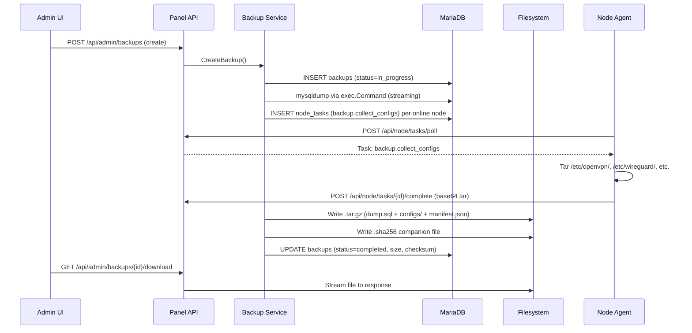
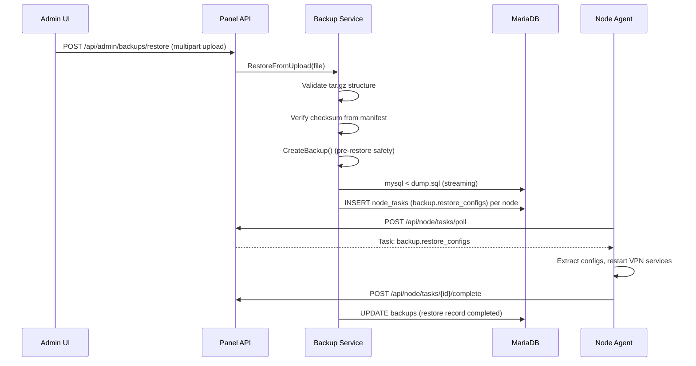

# Design Document: Backup System Upgrade

## Overview

This design replaces the current minimal SQL dump goroutine in main.go with a comprehensive backup/restore system. The new system creates compressed archives containing full MariaDB dumps plus VPN configuration files collected from nodes via the task system, supports scheduled backups with retention policies, provides a complete admin UI for management, and enables full restore from uploaded backup files.

### Key Design Decisions

1. **Dedicated backup package**: A new `panel/internal/backup` package encapsulates all backup logic, replacing the inline goroutine in main.go. This keeps the main entrypoint clean and allows proper unit testing.
2. **Streaming architecture**: All backup operations use streaming I/O (pipe mysqldump stdout → gzip writer → tar writer → file) to stay within the 1GB RAM constraint. No full dump is held in memory.
3. **Task system for config collection**: Reuses the existing node agent task dispatch pattern (node_tasks table + poll) for collecting VPN configs from nodes, consistent with other node operations.
4. **Database-tracked state**: All backup operations are tracked in a `backups` table with status transitions (in_progress → completed/failed), enabling the UI to show real-time progress and history.
5. **Single concurrent backup**: A mutex prevents overlapping backup/restore operations to avoid resource contention on low-memory VPS deployments.
6. **Pre-restore safety backup**: Before any restore, the system automatically creates a safety backup so the admin can roll back if the restore causes issues.

## Architecture



### Restore Flow



## Components and Interfaces

### 1. Backup Service Package

New package: `panel/internal/backup/`

```go
package backup

// Service manages backup creation, scheduling, retention, and restore operations.
type Service struct {
    db        *sql.DB
    cfg       Config
    mu        sync.Mutex  // prevents concurrent backup/restore
    scheduler *Scheduler
}

// Config holds backup service configuration loaded from panel_settings.
type Config struct {
    StorageDir     string // default: /opt/KorisPanel/backups/
    Schedule       string // "daily:02", "weekly:sun:02", "disabled"
    RetentionCount int    // default: 7
    DBUser         string
    DBPass         string
    DBName         string
}

// CreateBackup initiates a new backup operation. Returns the backup record ID.
func (s *Service) CreateBackup(ctx context.Context) (int64, error)

// RestoreFromUpload validates and applies a backup from an uploaded file.
func (s *Service) RestoreFromUpload(ctx context.Context, file io.Reader, filename string) error

// VerifyIntegrity recomputes the checksum of a backup file and compares with stored value.
func (s *Service) VerifyIntegrity(backupID int64) (bool, error)

// DeleteBackup removes a backup archive and its companion files from disk and marks DB record.
func (s *Service) DeleteBackup(backupID int64) error

// ListBackups returns all backup records ordered by creation time.
func (s *Service) ListBackups() ([]BackupRecord, error)

// ApplyRetention deletes backups exceeding the retention count.
func (s *Service) ApplyRetention() error

// StartScheduler begins the background schedule evaluation loop.
func (s *Service) StartScheduler()
```

### 2. Panel API Endpoints

#### Admin Backup Endpoints (require admin auth)

| Method | Path | Description |
|--------|------|-------------|
| GET | `/api/admin/backups` | List all backup records |
| POST | `/api/admin/backups` | Trigger manual backup creation |
| GET | `/api/admin/backups/{id}/download` | Stream backup file download |
| POST | `/api/admin/backups/{id}/verify` | Verify backup integrity |
| DELETE | `/api/admin/backups/{id}` | Delete a backup |
| POST | `/api/admin/backups/restore` | Upload and restore from backup |
| GET | `/api/admin/backups/settings` | Get schedule and retention settings |
| PUT | `/api/admin/backups/settings` | Update schedule and retention settings |

### 3. Node Agent Task Handlers

| Task Action | Payload | Behavior |
|-------------|---------|----------|
| `backup.collect_configs` | `{}` | Tar and base64-encode files from /etc/openvpn/, /etc/wireguard/, /etc/ipsec.d/, /etc/xl2tpd/; return in completion response |
| `backup.restore_configs` | `{configs: "base64-tar"}` | Decode base64 tar, extract files to original paths, restart openvpn/wg-quick/ipsec/xl2tpd services as needed |

### 4. Frontend Components

#### Admin UI (`panel/web/admin/`)

- `src/views/BackupView.vue` — Main backup management page (list, actions, settings)
- `src/components/BackupSettings.vue` — Schedule and retention configuration form
- `src/components/BackupRestoreDialog.vue` — Upload dialog with validation and confirmation
- `src/composables/useBackups.ts` — API composable for backup endpoints

## Data Models

### Database Schema (new migration)

```sql
CREATE TABLE IF NOT EXISTS backups (
    id BIGINT AUTO_INCREMENT PRIMARY KEY,
    filename VARCHAR(255) NOT NULL,
    status ENUM('in_progress','completed','failed') NOT NULL DEFAULT 'in_progress',
    type ENUM('manual','scheduled','pre_restore') NOT NULL DEFAULT 'manual',
    size_bytes BIGINT NULL,
    checksum VARCHAR(64) NULL,
    nodes_included JSON NULL,
    nodes_skipped JSON NULL,
    error_message TEXT NULL,
    started_at TIMESTAMP DEFAULT CURRENT_TIMESTAMP,
    completed_at TIMESTAMP NULL,
    INDEX idx_status (status),
    INDEX idx_started_at (started_at)
);
```

### Backup Settings in panel_settings

| key_name | value (example) | Description |
|----------|----------------|-------------|
| `backup_schedule` | `daily:02` | Schedule type and hour (daily:HH, weekly:DAY:HH, disabled) |
| `backup_retention_count` | `7` | Maximum backups to keep |

### Backup Archive Structure (.tar.gz)

```
backup-2024-06-15-020000.tar.gz
├── dump.sql                          # Full MariaDB dump
├── manifest.json                     # Metadata and integrity info
└── configs/
    ├── node-tehran-01/
    │   ├── etc/openvpn/server.conf
    │   ├── etc/openvpn/keys/
    │   └── etc/wireguard/wg0.conf
    └── node-frankfurt-01/
        ├── etc/openvpn/server.conf
        └── etc/wireguard/wg0.conf
```

### manifest.json Format

```json
{
  "version": "1.0",
  "timestamp": "2024-06-15T02:00:00Z",
  "panel_version": "1.0.0",
  "database": "radius_next",
  "nodes_included": ["node-tehran-01", "node-frankfurt-01"],
  "nodes_skipped": [
    {"name": "node-dubai-01", "reason": "offline"}
  ],
  "files": {
    "dump.sql": {"size": 5242880},
    "configs/node-tehran-01": {"files_count": 5},
    "configs/node-frankfurt-01": {"files_count": 3}
  },
  "checksum_algorithm": "sha256",
  "checksum": "a1b2c3d4..."
}
```

### Node Agent Config Collection Response

```json
{
  "task_id": 123,
  "status": "completed",
  "result": {
    "configs_tar_base64": "<base64 encoded tar of /etc/openvpn + /etc/wireguard + /etc/ipsec.d + /etc/xl2tpd>",
    "files_count": 8,
    "total_size": 24576
  }
}
```

## Correctness Properties

*A property is a characteristic or behavior that should hold true across all valid executions of a system — essentially, a formal statement about what the system should do.*

### Property 1: Archive structure round-trip

*For any* valid backup operation that completes successfully, extracting the resulting .tar.gz archive SHALL produce exactly the files dump.sql, manifest.json, and the configs/ tree listed in the manifest.

**Validates: Requirements 3.3**

### Property 2: Checksum integrity verification

*For any* Backup_Archive with a stored checksum, computing SHA-256 over the archive file SHALL produce a hash that matches the stored checksum value (assuming no file corruption).

**Validates: Requirements 4.2, 4.3, 4.4**

### Property 3: Retention policy preserves newest backups

*For any* set of N completed backups with a retention count of K (where N > K), applying the retention policy SHALL delete exactly N-K backups, and the deleted backups SHALL all have earlier started_at timestamps than any retained backup.

**Validates: Requirements 7.2, 7.3**

### Property 4: Schedule matching correctness

*For any* valid schedule configuration and timestamp, the schedule evaluator SHALL trigger a backup if and only if the timestamp matches the configured pattern (daily:HH matches when hour=HH and minute=0; weekly:DAY:HH matches when weekday=DAY and hour=HH and minute=0).

**Validates: Requirements 6.2**

### Property 5: Manifest generation completeness

*For any* backup containing N node config sets and M skipped nodes, the generated manifest.json SHALL list exactly N entries in nodes_included and M entries in nodes_skipped, and nodes_included + nodes_skipped SHALL equal the total set of online + offline nodes at backup time.

**Validates: Requirements 4.1, 2.5, 2.6**

### Property 6: Backup filename uniqueness

*For any* two backups created at different timestamps, their generated filenames SHALL be distinct (the "backup-{YYYY-MM-DD-HHmmss}.tar.gz" format ensures uniqueness to the second).

**Validates: Requirements 3.2**

### Property 7: Concurrent backup prevention

*For any* attempt to create a backup while another backup has status "in_progress", the Backup_Service SHALL reject the second attempt without starting a new backup operation.

**Validates: Requirements 6.4, 11.2**

### Property 8: Restore validation rejects invalid archives

*For any* uploaded file that is not a valid .tar.gz OR does not contain both dump.sql and manifest.json at the root level, the restore operation SHALL return a validation error without modifying the database.

**Validates: Requirements 8.1, 8.5**

## Error Handling

| Scenario | Response | Recovery |
|----------|----------|----------|
| mysqldump failure (non-zero exit) | Backup status "failed", error_message = stderr | Admin checks DB credentials/connectivity |
| Storage directory not writable | Backup status "failed", error = "storage_dir_not_writable" | Admin fixes permissions on /opt/KorisPanel/backups/ |
| Node config collection timeout (60s) | Node marked "skipped" in manifest, backup continues | Retry backup later or fix node connectivity |
| Disk space insufficient | Backup status "failed", error from OS write | Admin frees disk space or adjusts retention |
| Concurrent backup attempt | 409 Conflict `{"error": "backup_in_progress"}` | Wait for current backup to complete |
| Invalid restore file | 400 Bad Request `{"error": "invalid_archive", "detail": "..."}` | Admin uploads correct file |
| Checksum mismatch on restore | 400 Bad Request `{"error": "checksum_mismatch"}` | Archive corrupted, use different backup |
| Checksum mismatch on verify | Response: `{"valid": false, "expected": "...", "actual": "..."}` | Backup file corrupted, re-create |
| Backup file not found on disk | 404 `{"error": "backup_file_not_found"}` | File was manually deleted; record remains |
| mysql restore command failure | Restore status "failed", error_message = stderr | Admin reviews dump compatibility |

## Testing Strategy

### Property-Based Tests (Go: pgregory.net/rapid)

Property-based testing is appropriate for this feature because it contains pure functions with clear input/output relationships: archive structure validation, checksum computation, retention policy logic, schedule matching, and manifest generation.

**Configuration:** Minimum 100 iterations per property test.

| Property | Test Location | What Varies |
|----------|---------------|-------------|
| P1: Archive structure round-trip | `panel/internal/backup/archive_test.go` | Random file trees, dump sizes, number of nodes |
| P2: Checksum integrity | `panel/internal/backup/checksum_test.go` | Random byte content of varying sizes |
| P3: Retention preserves newest | `panel/internal/backup/retention_test.go` | Random backup lists with various timestamps, varying K |
| P4: Schedule matching | `panel/internal/backup/schedule_test.go` | Random timestamps against all schedule types |
| P5: Manifest completeness | `panel/internal/backup/manifest_test.go` | Random sets of online/offline nodes |
| P6: Filename uniqueness | `panel/internal/backup/naming_test.go` | Random distinct timestamps |
| P7: Concurrent prevention | `panel/internal/backup/service_test.go` | Concurrent goroutine attempts |
| P8: Restore validation | `panel/internal/backup/restore_test.go` | Random invalid tar.gz files (missing dump.sql, missing manifest, non-tar) |

### Unit Tests (example-based)

- Archive creation with zero nodes (SQL dump only)
- Archive creation with multiple nodes
- Manifest JSON serialization/deserialization
- Schedule parsing from panel_settings values
- Retention with exactly K backups (no deletion)
- Retention with 0 backups (no-op)
- Download streaming with correct Content-Type headers
- Settings GET/PUT round-trip

### Integration Tests

- Full backup lifecycle: create → verify → download → delete
- Restore flow: upload → validate → apply SQL → dispatch node tasks
- Schedule trigger at configured time
- Retention cleanup after backup completes
- Pre-restore safety backup creation
- Node agent config collection task execution

### Smoke Tests

- Migration applies cleanly (backups table created)
- Storage directory creation with correct permissions
- mysqldump binary availability check
- Basic tar.gz can be created and extracted

