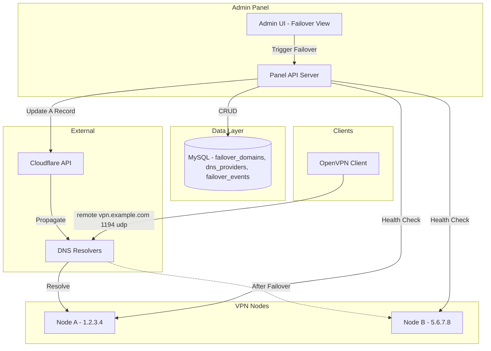
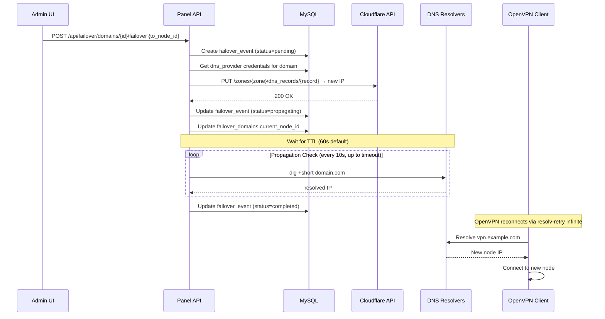

# Design Document: DNS Failover Profiles

## Overview

The DNS Failover system enables transparent server migration for OpenVPN clients by using domain names instead of direct IPs in `.ovpn` configuration files. When a VPN node gets blocked, the admin (or an automated health check) updates the DNS A record to point to a different node's IP. All existing clients reconnect automatically via the domain without needing to re-download their profile.

The system integrates with the existing panel architecture: a new set of API endpoints for managing failover domains and DNS providers, a modified OpenVPN profile generation path that resolves failover domains, optional Cloudflare API integration for programmatic DNS updates, and an auto-failover worker that detects offline nodes and triggers failover automatically.

## Architecture




## Failover Flow Sequence




## Data Models

The schema is defined in migration `019_dns_failover.sql` (already created).

### dns_providers

Stores credentials for DNS API integrations (currently Cloudflare, extensible to others).

```go
type DNSProvider struct {
    ID               int64  `json:"id"`
    Name             string `json:"name"`
    Type             string `json:"type"`              // "cloudflare" | "manual"
    APITokenEncrypted string `json:"-"`                // encrypted at rest, never exposed via API
    ZoneID           string `json:"zone_id,omitempty"` // Cloudflare zone ID
    AccountID        string `json:"account_id,omitempty"`
    IsActive         bool   `json:"is_active"`
    CreatedAt        string `json:"created_at"`
    UpdatedAt        string `json:"updated_at"`
}
```

### failover_domains

Maps a domain name to its current target node. Each domain has a low TTL (default 60s) for fast propagation.

```go
type FailoverDomain struct {
    ID             int64   `json:"id"`
    Domain         string  `json:"domain"`           // e.g. "vpn.example.com"
    CurrentNodeID  int64   `json:"current_node_id"`
    DNSProviderID  *int64  `json:"dns_provider_id"`  // nil = manual DNS management
    DNSRecordID    string  `json:"dns_record_id"`    // Cloudflare record ID for API updates
    TTL            int     `json:"ttl"`              // seconds, default 60
    IsActive       bool    `json:"is_active"`
    LastFailoverAt *string `json:"last_failover_at"`
    CreatedAt      string  `json:"created_at"`
    UpdatedAt      string  `json:"updated_at"`
    // Joined fields for display
    CurrentNodeName string `json:"current_node_name,omitempty"`
    CurrentNodeIP   string `json:"current_node_ip,omitempty"`
    ProviderName    string `json:"provider_name,omitempty"`
}
```

### failover_events

Audit log of every failover action with status tracking through the propagation lifecycle.

```go
type FailoverEvent struct {
    ID                       int64   `json:"id"`
    DomainID                 int64   `json:"domain_id"`
    FromNodeID               int64   `json:"from_node_id"`
    ToNodeID                 int64   `json:"to_node_id"`
    Reason                   string  `json:"reason"`           // "manual", "auto_offline", "auto_blocked"
    Status                   string  `json:"status"`           // "pending","propagating","completed","failed","rolled_back"
    DNSPropagationStartedAt  *string `json:"dns_propagation_started_at"`
    DNSPropagationCompletedAt *string `json:"dns_propagation_completed_at"`
    TriggeredBy              string  `json:"triggered_by"`     // "admin" or "auto"
    ErrorMessage             *string `json:"error_message"`
    CreatedAt                string  `json:"created_at"`
    // Joined fields
    DomainName   string `json:"domain_name,omitempty"`
    FromNodeName string `json:"from_node_name,omitempty"`
    ToNodeName   string `json:"to_node_name,omitempty"`
}
```


## Components and Interfaces

### Component 1: DNS Provider Service

**Purpose**: Abstracts DNS record management across providers (Cloudflare API or manual).

```go
// DNSUpdater is the interface for programmatic DNS record updates.
type DNSUpdater interface {
    // UpdateARecord changes the A record for a domain to point to a new IP.
    UpdateARecord(ctx context.Context, domain string, newIP string, ttl int) error
    // GetCurrentIP returns the IP currently set for the A record.
    GetCurrentIP(ctx context.Context, domain string) (string, error)
    // VerifyPropagation checks if DNS resolvers return the expected IP.
    VerifyPropagation(ctx context.Context, domain string, expectedIP string) (bool, error)
}

// CloudflareUpdater implements DNSUpdater using the Cloudflare API.
type CloudflareUpdater struct {
    apiToken string
    zoneID   string
    recordID string
    client   *http.Client
}

// ManualUpdater is a no-op that logs instructions for manual DNS updates.
type ManualUpdater struct{}
```

**Responsibilities**:
- Encrypt/decrypt API tokens at rest using panel's encryption key
- Cloudflare API calls: GET/PUT on `/zones/{zone}/dns_records/{record}`
- DNS propagation verification via system DNS resolver lookups
- Rate limiting API calls to respect Cloudflare limits (1200 req/5min)

### Component 2: Failover Orchestrator

**Purpose**: Manages the full failover lifecycle from trigger to completion.

```go
// FailoverOrchestrator coordinates a failover event.
type FailoverOrchestrator struct {
    db         *sql.DB
    updater    DNSUpdater
    notifier   *notify.Notifier
    timeout    time.Duration  // propagation timeout from panel_settings
    checkInterval time.Duration // how often to check propagation (10s)
}

// TriggerFailover initiates a failover for a domain to a new node.
func (fo *FailoverOrchestrator) TriggerFailover(ctx context.Context, req FailoverRequest) (*FailoverEvent, error)

// CheckPropagation polls DNS until the new IP is visible or timeout.
func (fo *FailoverOrchestrator) CheckPropagation(ctx context.Context, eventID int64) error

// Rollback reverts a failed failover to the previous node.
func (fo *FailoverOrchestrator) Rollback(ctx context.Context, eventID int64) error

type FailoverRequest struct {
    DomainID    int64
    ToNodeID    int64
    Reason      string  // "manual" | "auto_offline" | "auto_blocked"
    TriggeredBy string  // "admin" | "auto"
}
```

**Responsibilities**:
- Validate target node is online and different from current
- Create failover_event record with status tracking
- Delegate DNS update to DNSUpdater
- Run propagation check loop in background goroutine
- Update domain's `current_node_id` and `last_failover_at` on completion
- Send Telegram notification on failover events
- Handle rollback on failure (revert DNS to previous IP)

### Component 3: Auto-Failover Worker

**Purpose**: Background goroutine that monitors node health and triggers automatic failover.

```go
// AutoFailoverWorker runs periodic health checks on nodes with failover domains.
type AutoFailoverWorker struct {
    db            *sql.DB
    orchestrator  *FailoverOrchestrator
    checkInterval time.Duration // from panel_settings: dns_failover_check_interval
    enabled       bool          // from panel_settings: dns_failover_enabled
}

// Run starts the auto-failover loop (called from main server startup).
func (w *AutoFailoverWorker) Run(ctx context.Context)

// checkNode verifies if a node is responsive by checking last push time.
func (w *AutoFailoverWorker) checkNode(nodeID int64) (online bool, err error)

// selectFallbackNode picks the best available node for failover.
func (w *AutoFailoverWorker) selectFallbackNode(domainID int64, excludeNodeID int64) (int64, error)
```

**Responsibilities**:
- Read `dns_failover_enabled` and `dns_failover_check_interval` from panel_settings
- Every N seconds, query failover_domains where `is_active = 1`
- For each domain, check if `current_node_id` is online (via `node_diagnostics.updated_at` freshness)
- If node offline for > 2 consecutive checks, trigger automatic failover
- Select fallback node: prefer online nodes not already used by other failover domains
- Log auto-failover actions with `triggered_by = 'auto'`

### Component 4: Profile Generation (Modified)

**Purpose**: Modify the existing `openVPNEndpointNode` to prefer failover domains.

```go
// openVPNEndpointNode is modified to check for an active failover domain.
// Priority order:
//   1. If node has an active failover_domain → use that domain name as host
//   2. If node has a domain field set → use node.domain (existing behavior)
//   3. Fall back to node.public_ip (existing behavior)
func (s *Server) openVPNEndpointNode(r *http.Request, nodeID int64) (host string, port int, proto string, nodeName string) {
    // ... existing port/proto lookup ...

    if nodeID > 0 {
        // NEW: Check for active failover domain pointing to this node
        var failoverDomain string
        err := s.DB.QueryRow(
            `SELECT fd.domain FROM failover_domains fd
             WHERE fd.current_node_id = ? AND fd.is_active = 1 LIMIT 1`, nodeID,
        ).Scan(&failoverDomain)
        if err == nil && failoverDomain != "" {
            host = failoverDomain
        }
        // ... existing fallback to node.domain / node.public_ip ...
    }
}
```


## API Endpoints

All endpoints follow existing panel patterns (JSON request/response, `requireAdmin` middleware, audit logging).

### DNS Providers

| Method | Path | Description |
|--------|------|-------------|
| GET | `/api/failover/providers` | List all DNS providers |
| POST | `/api/failover/providers` | Create a DNS provider |
| PATCH | `/api/failover/providers/{id}` | Update a DNS provider |
| DELETE | `/api/failover/providers/{id}` | Delete a DNS provider |
| POST | `/api/failover/providers/{id}/test` | Test API connectivity |

**POST /api/failover/providers** — Create provider:
```go
type CreateProviderRequest struct {
    Name      string `json:"name"`       // required, unique
    Type      string `json:"type"`       // "cloudflare" | "manual"
    APIToken  string `json:"api_token"`  // required for cloudflare
    ZoneID    string `json:"zone_id"`    // required for cloudflare
    AccountID string `json:"account_id"` // optional
}
// Response: { "ok": true, "provider": DNSProvider }
```

**POST /api/failover/providers/{id}/test** — Verify Cloudflare credentials:
```go
// Calls Cloudflare GET /zones/{zone_id} to verify token + zone access
// Response: { "ok": true, "message": "Connection successful" }
// or:       { "ok": false, "error": "invalid_token", "message": "..." }
```

### Failover Domains

| Method | Path | Description |
|--------|------|-------------|
| GET | `/api/failover/domains` | List all failover domains |
| POST | `/api/failover/domains` | Create a failover domain |
| PATCH | `/api/failover/domains/{id}` | Update a failover domain |
| DELETE | `/api/failover/domains/{id}` | Delete a failover domain |
| POST | `/api/failover/domains/{id}/failover` | Trigger manual failover |
| GET | `/api/failover/domains/{id}/status` | Get propagation status |

**POST /api/failover/domains** — Create domain:
```go
type CreateDomainRequest struct {
    Domain        string `json:"domain"`          // required, unique, valid FQDN
    CurrentNodeID int64  `json:"current_node_id"` // required, must exist
    DNSProviderID *int64 `json:"dns_provider_id"` // optional (nil = manual)
    DNSRecordID   string `json:"dns_record_id"`   // Cloudflare record ID
    TTL           int    `json:"ttl"`             // default 60, min 30
}
// Response: { "ok": true, "domain": FailoverDomain }
```

**POST /api/failover/domains/{id}/failover** — Trigger failover:
```go
type TriggerFailoverRequest struct {
    ToNodeID int64  `json:"to_node_id"` // required, target node
    Reason   string `json:"reason"`     // optional, default "manual"
}
// Response: { "ok": true, "event": FailoverEvent }
// Errors:
//   400 "same_node" — target is the same as current
//   400 "node_offline" — target node is not online
//   409 "failover_in_progress" — another failover is already pending/propagating
//   500 "dns_update_failed" — Cloudflare API error
```

**GET /api/failover/domains/{id}/status** — Propagation status:
```go
// Response: {
//   "ok": true,
//   "domain": "vpn.example.com",
//   "current_ip": "5.6.7.8",
//   "expected_ip": "5.6.7.8",
//   "propagated": true,
//   "last_event": FailoverEvent
// }
```

### Failover Events

| Method | Path | Description |
|--------|------|-------------|
| GET | `/api/failover/events` | List failover events (paginated, filterable) |
| GET | `/api/failover/events/{id}` | Get single event details |
| POST | `/api/failover/events/{id}/rollback` | Rollback a completed failover |

### Settings

Failover settings are managed via the existing `/api/panel-settings` endpoint:

```go
// Settings stored in panel_settings table:
// - dns_failover_enabled: "true"/"false" — master switch for auto-failover
// - dns_failover_check_interval: "30" — seconds between health checks
// - dns_failover_auto_rollback: "true"/"false" — auto-rollback on failure
// - dns_failover_propagation_timeout: "300" — seconds before marking propagation failed
```


## OpenVPN Profile Generation

### Current Behavior

The existing `openVPNEndpointNode` function resolves the VPN host using this priority:
1. Node's `domain` field (if set)
2. Node's `public_ip` field
3. Request host as fallback

The `.ovpn` file contains `remote <host> <port>` with the `resolv-retry infinite` directive.

### Modified Behavior

The profile generation gains a new priority level — failover domain lookup:

```go
// Resolution priority (modified):
// 1. Active failover_domain pointing to this node → use domain name
// 2. Node's domain field (existing)
// 3. Node's public_ip (existing)
// 4. Request host fallback (existing)
```

### Key OpenVPN Directives for Failover

The generated `.ovpn` already includes the critical directives that enable seamless failover:

```
client
proto udp
remote vpn.example.com 1194    ← domain instead of IP
resolv-retry infinite           ← keeps retrying DNS resolution on disconnect
persist-key                     ← don't re-read key on restart
persist-tun                     ← don't close/reopen TUN device on restart
explicit-exit-notify 1          ← clean disconnect signal
```

The `resolv-retry infinite` directive is critical: when the VPN connection drops (because the old server IP is blocked), OpenVPN will re-resolve the domain, pick up the new IP, and reconnect automatically.

### Low TTL Strategy

All failover domains use a default TTL of 60 seconds. This ensures:
- DNS caches expire within 1 minute of a failover
- Clients re-resolve the domain on their next connection attempt
- Maximum reconnection time ≈ TTL + OpenVPN keepalive timeout (120s) ≈ 3 minutes

The TTL is configurable per domain (minimum 30s) to allow tuning for specific DNS provider constraints.


## Cloudflare Integration

### API Interactions

The Cloudflare updater uses the official REST API v4:

```go
// Base URL: https://api.cloudflare.com/client/v4

// 1. Verify token and zone access
// GET /zones/{zone_id}
// Headers: Authorization: Bearer <api_token>

// 2. Get existing DNS record (to read current IP)
// GET /zones/{zone_id}/dns_records/{record_id}

// 3. Update A record to new IP
// PUT /zones/{zone_id}/dns_records/{record_id}
// Body: { "type": "A", "name": "vpn.example.com", "content": "5.6.7.8", "ttl": 60, "proxied": false }

// 4. List records (for initial record ID discovery)
// GET /zones/{zone_id}/dns_records?type=A&name=vpn.example.com
```

### Security

- API tokens are encrypted at rest using AES-256-GCM with the panel's encryption key
- Tokens are never exposed via API responses (field is tagged `json:"-"`)
- The `/test` endpoint verifies connectivity without exposing the token
- Cloudflare tokens should be scoped to: `Zone.DNS:Edit` for the specific zone

### Error Handling

```go
// Cloudflare API error responses:
// 401 → invalid token → mark provider as inactive, log error
// 403 → insufficient permissions → notify admin
// 429 → rate limited → exponential backoff, retry after header
// 5xx → Cloudflare outage → retry up to 3 times with backoff
```


## Auto-Failover Logic

### Node Health Detection

The panel already receives periodic pushes from node agents (via `POST /api/node/push`). Node health is determined by staleness of `node_diagnostics.updated_at`:

```go
// Node is considered offline if:
//   time.Since(lastPush) > 2 * checkInterval
//
// With default checkInterval = 30s, a node is offline after 60s without a push.
// The auto-failover worker requires 2 consecutive offline checks (total ~90s)
// before triggering failover to avoid false positives from network blips.
```

### Fallback Node Selection

```go
func (w *AutoFailoverWorker) selectFallbackNode(domainID int64, excludeNodeID int64) (int64, error) {
    // Selection criteria (priority order):
    // 1. Nodes with status='online' that are NOT already targeted by another failover_domain
    // 2. Among those, prefer nodes with the most recent successful push
    // 3. Exclude the currently failing node
    //
    // Query:
    // SELECT n.id FROM nodes n
    // LEFT JOIN failover_domains fd ON fd.current_node_id = n.id AND fd.is_active = 1
    // WHERE n.id != ? AND n.status = 'online' AND fd.id IS NULL
    // ORDER BY (SELECT nd.updated_at FROM node_diagnostics nd WHERE nd.node_id = n.id) DESC
    // LIMIT 1
}
```

### Auto-Failover Settings

| Setting | Default | Description |
|---------|---------|-------------|
| `dns_failover_enabled` | `false` | Master switch for the auto-failover worker |
| `dns_failover_check_interval` | `30` | Seconds between health checks |
| `dns_failover_auto_rollback` | `false` | Revert failover if original node comes back online |
| `dns_failover_propagation_timeout` | `300` | Seconds before marking propagation as failed |


## Admin UI

### Failover Domains View (`/dashboard/failover`)

The main view shows a table of all configured failover domains with:

| Column | Description |
|--------|-------------|
| Domain | The FQDN (e.g., `vpn.example.com`) |
| Current Node | Node name + IP currently pointed to |
| Provider | DNS provider name or "Manual" |
| TTL | Configured TTL in seconds |
| Status | Active/Inactive badge |
| Last Failover | Timestamp of last failover event |
| Actions | Failover button, Edit, Delete |

**One-Click Failover Button**: Opens a modal showing:
- Current node (from) with IP
- Dropdown to select target node (to) — filtered to online nodes only
- Reason field (optional text)
- "Trigger Failover" confirmation button
- After trigger: live propagation status with progress indicator

### Provider Settings (`/dashboard/failover/providers`)

- List of configured DNS providers
- Add provider form: Name, Type (Cloudflare/Manual), API Token, Zone ID
- Test connection button per provider
- Active/Inactive toggle

### Failover Events Log (`/dashboard/failover/events`)

- Chronological list of all failover events
- Filterable by domain, status, trigger type
- Shows: timestamp, domain, from→to nodes, status badge, triggered by
- Expandable detail with error messages and propagation timings

### Real-time Updates

The existing WebSocket at `/api/realtime` is extended to push failover status updates:

```go
// New WebSocket event types:
// "failover:started"    → { domain_id, from_node, to_node }
// "failover:propagating" → { domain_id, event_id }
// "failover:completed"  → { domain_id, event_id, duration_seconds }
// "failover:failed"     → { domain_id, event_id, error }
```


## Error Handling

### Error Scenario 1: Cloudflare API Failure

**Condition**: Cloudflare returns 4xx/5xx during DNS update
**Response**: Mark failover_event status = 'failed', store error message, notify admin via Telegram
**Recovery**: Admin can retry via the UI; for 429 rate limits, automatic exponential backoff (1s, 2s, 4s, max 3 retries)

### Error Scenario 2: Propagation Timeout

**Condition**: DNS resolvers still return old IP after `dns_failover_propagation_timeout` seconds
**Response**: Mark event status = 'failed', keep the DNS update in place (record was already changed)
**Recovery**: Admin can check manually; the DNS will eventually propagate. Event stays in 'failed' for visibility but domain still points to new IP.

### Error Scenario 3: Target Node Goes Offline After Failover

**Condition**: The node we failed over TO becomes unreachable
**Response**: If `dns_failover_auto_rollback` is enabled and the original node is back online, trigger reverse failover
**Recovery**: Creates a new failover_event with reason = 'auto_rollback'

### Error Scenario 4: No Available Fallback Node

**Condition**: Auto-failover triggered but no other online nodes are available
**Response**: Log warning, send Telegram notification, do NOT change DNS (keep pointing to offline node in case it recovers)
**Recovery**: Admin must bring a new node online or manually resolve

### Error Scenario 5: Concurrent Failover Attempt

**Condition**: A failover is triggered while another is still pending/propagating for the same domain
**Response**: Return 409 Conflict — "failover_in_progress"
**Recovery**: Wait for current failover to complete or fail before triggering a new one


## Testing Strategy

### Unit Testing Approach

- **DNSProvider CRUD**: Test create/update/delete with validation (unique names, valid types, token encryption)
- **FailoverDomain CRUD**: Test domain validation, node existence checks, TTL bounds
- **FailoverOrchestrator**: Mock DNSUpdater interface to test state transitions without real API calls
- **Profile Generation**: Verify failover domain takes priority over node.domain and node.public_ip
- **Auto-Failover Worker**: Mock DB and orchestrator to test health check logic and node selection

### Property-Based Testing Approach

**Property Test Library**: Use Go's `testing/quick` package or `github.com/leanovate/gopter`

Key properties to test:
1. Failover domain resolution is deterministic (same node always resolves to same domain)
2. TTL values are always within bounds (30 ≤ ttl ≤ 86400)
3. A failover event always transitions through valid states (pending → propagating → completed|failed)
4. No two active failover domains point to the same domain name
5. Auto-failover never triggers for nodes with status = 'online' and fresh diagnostics

### Integration Testing Approach

- **End-to-end failover flow**: Create provider → create domain → trigger failover → verify event lifecycle
- **Profile download integration**: Create failover domain → download .ovpn → verify `remote` directive uses domain
- **Cloudflare API mock**: HTTP test server that mimics Cloudflare responses for CI testing


## Correctness Properties

*A property is a characteristic or behavior that should hold true across all valid executions of a system—essentially, a formal statement about what the system should do. Properties serve as the bridge between human-readable specifications and machine-verifiable correctness guarantees.*

### Property 1: Profile Domain Resolution Priority

*For any* node with an active Failover_Domain, the Profile_Generator SHALL use the Failover_Domain name as the remote host, taking priority over both the node's domain field and public IP.

**Validates: Requirements 6.1, 6.2**

### Property 2: Failover State Machine Validity

*For any* Failover_Event, the status transitions must follow only valid paths: pending → propagating → completed, pending → propagating → failed, pending → failed (immediate DNS error), or completed → rolled_back (explicit rollback only). No other transitions are valid and status can never go backwards.

**Validates: Requirement 8.4**

### Property 3: Domain Uniqueness Invariant

*For any* two active Failover_Domains with different IDs, their domain values must be different. No two active records may share the same domain name.

**Validates: Requirement 2.1**

### Property 4: Concurrent Failover Prevention

*For any* Failover_Domain, at most one Failover_Event may be in status "pending" or "propagating" at any point in time. Attempting a second failover while one is active is always rejected with a 409 conflict.

**Validates: Requirement 3.3**

### Property 5: TTL Bounds Enforcement

*For any* Failover_Domain, the TTL value must satisfy 30 ≤ TTL ≤ 86400. Values outside this range are rejected during creation and update. A missing or zero TTL defaults to 60.

**Validates: Requirement 2.3**

### Property 6: Auto-Failover Safety Guards

*For any* system state, auto-failover must NOT trigger if: dns_failover_enabled is "false", the node's last push is within 2 × check_interval seconds, there is already a pending/propagating failover for the domain, or no alternative online nodes exist.

**Validates: Requirements 7.2, 7.3, 7.6**

### Property 7: API Token Confidentiality

*For any* API response containing a DNS_Provider object, the API token field must be empty or absent. Encrypted tokens are never included in JSON responses regardless of the request context.

**Validates: Requirement 1.4**

### Property 8: Failover Event Audit Completeness

*For any* change to a Failover_Domain's current_node_id, there must exist a corresponding Failover_Event where the event's domain_id matches the domain and the event's to_node_id matches the new current_node_id value.

**Validates: Requirement 8.1**

### Property 9: API Token Encryption Round-Trip

*For any* API token string, encrypting then decrypting with the panel's encryption key must produce the original token value. The stored ciphertext must differ from the plaintext input.

**Validates: Requirement 1.3**

### Property 10: Same-Node Failover Rejection

*For any* Failover_Domain, attempting a failover where the target node equals the current node must always be rejected with an appropriate error.

**Validates: Requirement 3.1**

### Property 11: Offline Target Node Rejection

*For any* failover request targeting a node that is offline, the Failover_Orchestrator must reject the request regardless of other conditions.

**Validates: Requirement 3.2**

### Property 12: Fallback Node Selection Preference

*For any* set of candidate nodes during auto-failover, the selection algorithm must prefer online nodes that are not already targeted by another active Failover_Domain over those that are.

**Validates: Requirement 7.5**

### Property 13: Inactive Domain Exclusion

*For any* deactivated Failover_Domain (is_active = false), the profile generation lookup must never return that domain, and the auto-failover worker must never perform health checks for it.

**Validates: Requirement 2.4**

### Property 14: Resolv-Retry Directive Presence

*For any* generated OpenVPN profile, the output must contain the "resolv-retry infinite" directive to enable automatic DNS re-resolution.

**Validates: Requirement 6.4**


## Performance Considerations

- **DNS Propagation Checking**: Propagation checks run in a background goroutine per failover event. With a 10-second polling interval and 300-second timeout, at most 30 DNS lookups per failover. Multiple concurrent failovers are bounded by the number of active domains (expected < 20).

- **Database Queries**: The modified `openVPNEndpointNode` adds one extra SELECT query per profile download. This is acceptable given profile downloads are infrequent (once per customer per node change). Query is indexed on `current_node_id` + `is_active`.

- **Auto-Failover Worker**: Single goroutine with configurable interval (default 30s). Each tick queries `failover_domains` (small table) and checks `node_diagnostics.updated_at` (indexed). Expected overhead: negligible.

- **Cloudflare Rate Limits**: 1200 requests per 5 minutes per API token. A single failover uses 1-2 API calls (update + optional verify). Auto-failover with 10 domains would use at most 20 calls in a burst — well within limits.

## Security Considerations

- **API Token Storage**: Cloudflare API tokens are encrypted with AES-256-GCM before storage. The encryption key is derived from the panel's `PANEL_SECRET` environment variable.

- **Access Control**: All failover API endpoints use `requireAdmin` middleware — only authenticated admin sessions can manage domains or trigger failovers.

- **Input Validation**: Domain names are validated as proper FQDNs (RFC 1035). Node IDs are verified to exist. TTL has enforced bounds.

- **Audit Trail**: Every failover action creates a `failover_events` record with full before/after state and trigger source (admin vs auto).

## Dependencies

- **Cloudflare API v4** — External HTTP API for programmatic DNS record management (optional; system works in "manual" mode without it)
- **net** (Go stdlib) — DNS resolution for propagation verification (`net.LookupHost`)
- **crypto/aes**, **crypto/cipher** (Go stdlib) — AES-256-GCM encryption for API tokens at rest
- **Existing panel infrastructure** — MySQL database, admin auth middleware, Telegram notifier, WebSocket realtime, panel_settings table
