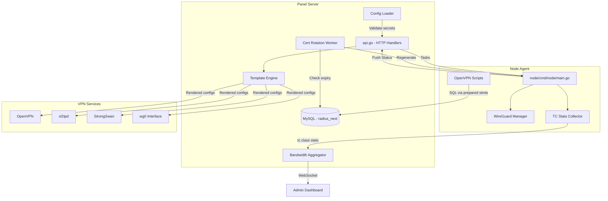
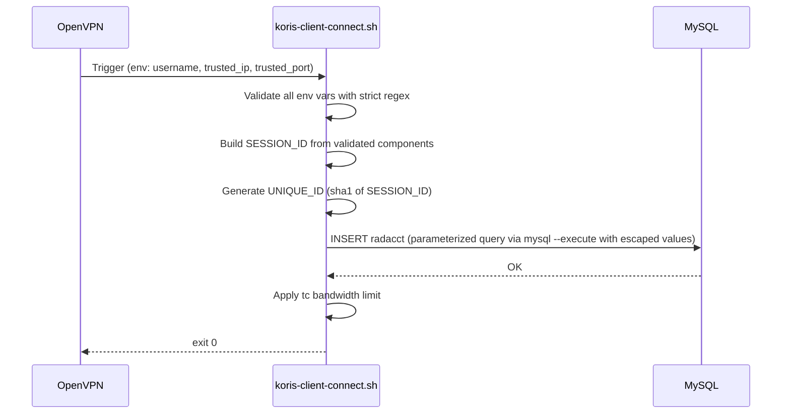
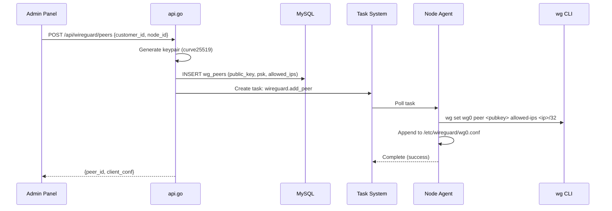
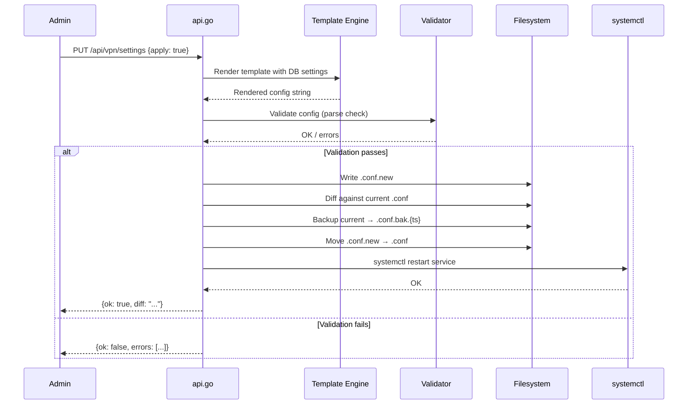
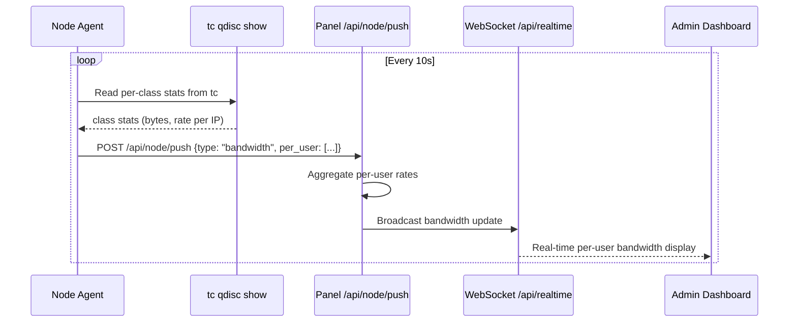
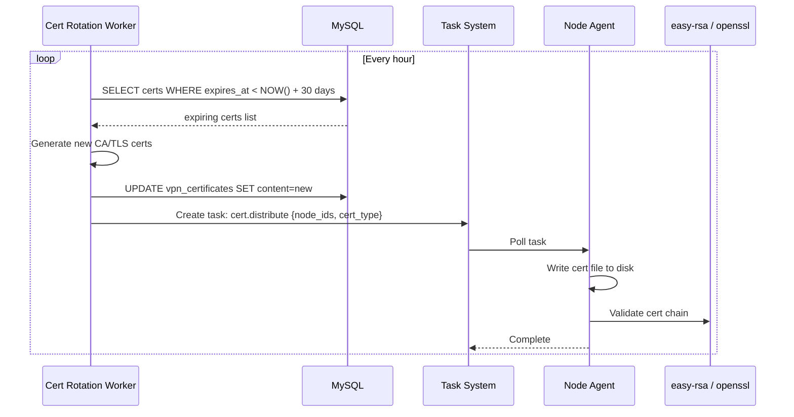

# Design Document: VPN Core Improvements

## Overview

This design covers a comprehensive set of security fixes and feature additions to the KorisPanel VPN management system. The security track addresses SQL injection vulnerabilities in OpenVPN environment variable handling, hardcoded secrets and IPs in shell scripts, and unsafe config application in the Go API layer. The feature track adds WireGuard as a fourth VPN protocol, dual-stack IPv6 support, a Go template-based config system replacing fragile line rewriting, real-time per-user bandwidth streaming, automatic certificate rotation, connection limit double-enforcement in the auth script, and log rotation configuration.

The improvements are designed to be backward-compatible with existing OpenVPN/L2TP/IKEv2 deployments while extending the system's protocol coverage and operational safety. All changes follow the existing panel/node architecture where the panel manages state and pushes tasks, while nodes execute protocol-level operations.

## Architecture



## Sequence Diagrams

### Security: Sanitized OpenVPN Client Connect



### WireGuard Peer Addition



### Config Templating Apply Flow



### Real-Time Bandwidth Push



### Certificate Rotation



## Components and Interfaces

### Component 1: Input Sanitizer (Shell Scripts)

**Purpose**: Validates all OpenVPN environment variables before any DB interaction

```go
// Equivalent logic expressed in Go for documentation; actual implementation is bash
type InputValidator struct {
    UsernamePattern *regexp.Regexp  // ^[A-Za-z0-9_.-]{1,64}$
    IPv4Pattern     *regexp.Regexp  // ^[0-9]{1,3}\.[0-9]{1,3}\.[0-9]{1,3}\.[0-9]{1,3}$
    IPv6Pattern     *regexp.Regexp  // ^[0-9a-fA-F:]+$
    PortPattern     *regexp.Regexp  // ^[0-9]{1,5}$
    NumericPattern  *regexp.Regexp  // ^[0-9]+$
}

func (v *InputValidator) ValidateSessionComponents(cn, trustedIP, trustedPort string) error
func (v *InputValidator) SanitizeCause(raw string) string
func (v *InputValidator) EscapeSQL(input string) string
```

**Responsibilities**:
- Reject any `common_name` that doesn't match strict alphanumeric pattern
- Validate `trusted_ip` as valid IPv4/IPv6 before use in SESSION_ID
- Validate `trusted_port` as numeric
- Sanitize all heredoc SQL values through parameterized escaping

### Component 2: Config Template Engine

**Purpose**: Renders VPN service configs from Go templates with validation

```go
package templates

import (
    "text/template"
    "net"
)

type TemplateEngine struct {
    templates map[string]*template.Template  // protocol -> parsed template
    basePath  string                          // /etc/koris/templates/
}

type TemplateVars struct {
    Port         int
    Protocol     string
    Network      string
    NetworkIPv6  string
    DNS1         string
    DNS2         string
    DNS1v6       string
    DNS2v6       string
    IPSecPSK     string
    ServerIP     string
    ExtraJSON    map[string]any
}

func NewEngine(basePath string) (*TemplateEngine, error)
func (e *TemplateEngine) Render(protocol string, vars TemplateVars) (string, error)
func (e *TemplateEngine) Validate(protocol string, rendered string) error
func (e *TemplateEngine) Diff(protocol string, current, proposed string) string
func (e *TemplateEngine) Apply(protocol, confPath string, vars TemplateVars) error
```

**Responsibilities**:
- Load template files for OpenVPN, StrongSwan, xl2tpd, WireGuard
- Validate network CIDR is RFC1918 private before applying
- Generate diff between current and proposed config
- Create backup before overwriting
- Refuse to apply if validation fails

### Component 3: WireGuard Manager (Node Agent)

**Purpose**: Manages WireGuard interface, keys, and peers on nodes

```go
package wireguard

import (
    "crypto/rand"
    "encoding/base64"
    "net"
)

type Manager struct {
    Interface   string  // "wg0"
    ListenPort  int
    ConfigPath  string  // "/etc/wireguard/wg0.conf"
}

type Peer struct {
    PublicKey    string
    PresharedKey string
    AllowedIPs  []net.IPNet
    Endpoint    string
}

type ServerKeys struct {
    PrivateKey string
    PublicKey  string
}

func (m *Manager) GenerateKeyPair() (ServerKeys, error)
func (m *Manager) AddPeer(peer Peer) error
func (m *Manager) RemovePeer(publicKey string) error
func (m *Manager) ListPeers() ([]Peer, error)
func (m *Manager) GenerateClientConfig(serverPubKey, endpoint string, peer Peer, dns []string) string
func (m *Manager) SyncConfig() error
func (m *Manager) Status() (isUp bool, peerCount int, err error)
```

**Responsibilities**:
- Generate Curve25519 key pairs for server and clients
- Add/remove peers via `wg set` and persist to config file
- Generate downloadable client `.conf` files
- Report WireGuard interface status to panel

### Component 4: Bandwidth Stats Collector (Node Agent)

**Purpose**: Reads tc class statistics and pushes per-user bandwidth data

```go
package bandwidth

type ClassStats struct {
    ClassID   string  // "1:123"
    Username  string  // looked up from IP mapping
    IP        string
    BytesSent int64
    BytesRecv int64
    RateBps   int64
    CeilBps   int64
}

type Collector struct {
    Interface string
    Interval  time.Duration
    prevStats map[string]ClassStats
}

func NewCollector(iface string, interval time.Duration) *Collector
func (c *Collector) Collect() ([]ClassStats, error)
func (c *Collector) DeltaRates(current, previous []ClassStats) []ClassStats
```

**Responsibilities**:
- Parse `tc -s class show dev tunX` output
- Calculate per-class byte deltas for rate computation
- Map class IDs back to user IPs (using last-octet convention from connect script)
- Include stats in node push payload

### Component 5: Certificate Rotation Worker

**Purpose**: Background goroutine that monitors cert expiry and triggers renewal

```go
package certrotation

import (
    "database/sql"
    "time"
)

type Worker struct {
    DB            *sql.DB
    CheckInterval time.Duration  // 1 hour
    WarnBefore    time.Duration  // 30 days
    RenewBefore   time.Duration  // 7 days
}

type CertInfo struct {
    ID        int64
    Name      string
    Type      string  // "ca", "tls_crypt", "client_cert", "client_key"
    NodeID    *int64
    ExpiresAt time.Time
}

func NewWorker(db *sql.DB) *Worker
func (w *Worker) Start()
func (w *Worker) CheckExpiring() ([]CertInfo, error)
func (w *Worker) Regenerate(cert CertInfo) error
func (w *Worker) DistributeToNodes(cert CertInfo, nodeIDs []int64) error
```

**Responsibilities**:
- Query `vpn_certificates` for certs approaching expiry
- Generate events/notifications for certs expiring within 30 days
- Automatically regenerate certs expiring within 7 days
- Distribute renewed certs to nodes via task system

### Component 6: IPv6 Address Pool Manager

**Purpose**: Manages IPv6 address allocation for dual-stack VPN tunnels

```go
package ipv6pool

import "net"

type Pool struct {
    Prefix  net.IPNet  // e.g., fd00:koris::/64
    Used    map[string]string  // IP -> username
}

func NewPool(prefix string) (*Pool, error)
func (p *Pool) Allocate(username string) (net.IP, error)
func (p *Pool) Release(username string) error
func (p *Pool) IsAvailable(ip net.IP) bool
```

## Data Models

### WireGuard Peers Table

```sql
CREATE TABLE IF NOT EXISTS wg_peers (
    id BIGINT AUTO_INCREMENT PRIMARY KEY,
    customer_id BIGINT NULL,
    node_id BIGINT NOT NULL,
    public_key VARCHAR(44) NOT NULL,        -- base64-encoded Curve25519
    preshared_key VARCHAR(44) NULL,
    private_key_encrypted TEXT NULL,         -- encrypted client private key for config download
    allowed_ips VARCHAR(128) NOT NULL,       -- e.g. "10.11.0.2/32,fd00:koris::2/128"
    endpoint VARCHAR(128) NULL,
    status ENUM('active','disabled','revoked') NOT NULL DEFAULT 'active',
    last_handshake_at DATETIME NULL,
    rx_bytes BIGINT NOT NULL DEFAULT 0,
    tx_bytes BIGINT NOT NULL DEFAULT 0,
    created_at TIMESTAMP DEFAULT CURRENT_TIMESTAMP,
    updated_at TIMESTAMP DEFAULT CURRENT_TIMESTAMP ON UPDATE CURRENT_TIMESTAMP,
    UNIQUE KEY node_pubkey (node_id, public_key),
    INDEX(customer_id), INDEX(node_id), INDEX(status)
) ENGINE=InnoDB DEFAULT CHARSET=utf8mb4;
```

**Validation Rules**:
- `public_key` must be exactly 44 characters (32 bytes base64)
- `allowed_ips` must be valid CIDR notation
- `node_id` must reference existing node
- One peer per customer per node (unique constraint)

### WireGuard Server Config Table

```sql
-- Extends node_vpn_configs: protocol ENUM adds 'wireguard'
ALTER TABLE node_vpn_configs MODIFY COLUMN protocol ENUM('openvpn','l2tp','ikev2','ssh','wireguard') NOT NULL;
```

### Certificate Expiry Extension

```sql
ALTER TABLE vpn_certificates ADD COLUMN expires_at DATETIME NULL AFTER is_default;
ALTER TABLE vpn_certificates ADD COLUMN fingerprint VARCHAR(128) NULL AFTER expires_at;
ALTER TABLE vpn_certificates ADD INDEX(expires_at);
```

### IPv6 Config Extension

```sql
ALTER TABLE node_vpn_configs ADD COLUMN network_ipv6 VARCHAR(64) NULL AFTER network;
```

### Bandwidth Snapshots Extension

```sql
CREATE TABLE IF NOT EXISTS user_bandwidth_snapshots (
    id BIGINT AUTO_INCREMENT PRIMARY KEY,
    node_id BIGINT NOT NULL,
    username VARCHAR(64) NOT NULL,
    ip VARCHAR(64) NOT NULL,
    rx_bps BIGINT NOT NULL DEFAULT 0,
    tx_bps BIGINT NOT NULL DEFAULT 0,
    created_at TIMESTAMP DEFAULT CURRENT_TIMESTAMP,
    INDEX(node_id), INDEX(username), INDEX(created_at)
) ENGINE=InnoDB DEFAULT CHARSET=utf8mb4;
```

## Algorithmic Pseudocode

### Algorithm: SQL Injection Prevention in Connect Script

```go
// validateSessionComponents ensures all components of SESSION_ID are safe
// before any SQL interaction occurs.
func validateSessionComponents(commonName, trustedIP, trustedPort, timeUnix string) error {
    // Step 1: Validate common_name (already done by OpenVPN auth, but double-check)
    usernameRe := regexp.MustCompile(`^[A-Za-z0-9_.-]{1,64}$`)
    if !usernameRe.MatchString(commonName) {
        return fmt.Errorf("invalid common_name: %q", commonName)
    }

    // Step 2: Validate trusted_ip as strict IPv4
    ipv4Re := regexp.MustCompile(`^[0-9]{1,3}\.[0-9]{1,3}\.[0-9]{1,3}\.[0-9]{1,3}$`)
    if trustedIP != "" && !ipv4Re.MatchString(trustedIP) {
        return fmt.Errorf("invalid trusted_ip: %q", trustedIP)
    }

    // Step 3: Validate trusted_port as numeric
    portRe := regexp.MustCompile(`^[0-9]{1,5}$`)
    if trustedPort != "" && !portRe.MatchString(trustedPort) {
        return fmt.Errorf("invalid trusted_port: %q", trustedPort)
    }

    // Step 4: Validate time_unix as numeric
    numericRe := regexp.MustCompile(`^[0-9]+$`)
    if timeUnix != "" && !numericRe.MatchString(timeUnix) {
        return fmt.Errorf("invalid time_unix: %q", timeUnix)
    }

    return nil
}
```

**Preconditions:**
- Function is called before SESSION_ID construction
- OpenVPN has set environment variables

**Postconditions:**
- Returns nil only if ALL components are safe for SQL interpolation
- Non-nil error causes script to reject connection (exit 1)
- No SQL characters can appear in validated values

### Algorithm: CIDR Validation for Config Apply

```go
// validatePrivateNetwork checks that a CIDR is a valid RFC1918/RFC4193 private network
// suitable for VPN tunnel addressing.
func validatePrivateNetwork(cidr string, allowIPv6 bool) error {
    ip, ipNet, err := net.ParseCIDR(strings.TrimSpace(cidr))
    if err != nil {
        return fmt.Errorf("invalid CIDR: %w", err)
    }

    // Check IPv4 private ranges
    if ip.To4() != nil {
        privateRanges := []net.IPNet{
            parseCIDR("10.0.0.0/8"),
            parseCIDR("172.16.0.0/12"),
            parseCIDR("192.168.0.0/16"),
        }
        for _, r := range privateRanges {
            if r.Contains(ip) {
                // Validate prefix length is reasonable for VPN (between /16 and /28)
                ones, _ := ipNet.Mask.Size()
                if ones < 16 || ones > 28 {
                    return fmt.Errorf("prefix /%d out of range [16,28]", ones)
                }
                return nil
            }
        }
        return fmt.Errorf("not a private IPv4 network: %s", cidr)
    }

    // Check IPv6 ULA range (fc00::/7)
    if allowIPv6 {
        ula := parseCIDR("fc00::/7")
        if ula.Contains(ip) {
            ones, _ := ipNet.Mask.Size()
            if ones < 48 || ones > 112 {
                return fmt.Errorf("IPv6 prefix /%d out of range [48,112]", ones)
            }
            return nil
        }
        return fmt.Errorf("not a ULA IPv6 network: %s", cidr)
    }

    return fmt.Errorf("IPv6 not allowed for this protocol")
}
```

**Preconditions:**
- `cidr` is a non-empty string
- Called before any config file write or service restart

**Postconditions:**
- Returns nil only if network is private and appropriately sized
- Prevents public IP ranges from being used as VPN tunnels
- Prevents overly broad (/8) or tiny (/30+) subnets

### Algorithm: WireGuard Key Generation

```go
// generateWireGuardKeyPair creates a Curve25519 keypair for WireGuard.
func generateWireGuardKeyPair() (privateKey, publicKey string, err error) {
    // Step 1: Generate 32 random bytes for private key
    privBytes := make([]byte, 32)
    if _, err := rand.Read(privBytes); err != nil {
        return "", "", fmt.Errorf("crypto/rand failed: %w", err)
    }

    // Step 2: Clamp private key per Curve25519 spec
    privBytes[0] &= 248
    privBytes[31] &= 127
    privBytes[31] |= 64

    // Step 3: Derive public key via Curve25519 scalar multiplication
    pubBytes, err := curve25519.X25519(privBytes, curve25519.Basepoint)
    if err != nil {
        return "", "", fmt.Errorf("curve25519 failed: %w", err)
    }

    // Step 4: Base64 encode both keys
    privateKey = base64.StdEncoding.EncodeToString(privBytes)
    publicKey = base64.StdEncoding.EncodeToString(pubBytes)

    return privateKey, publicKey, nil
}
```

**Preconditions:**
- System has access to cryptographic random source (`/dev/urandom`)

**Postconditions:**
- `privateKey` is 44-char base64 string (32 bytes)
- `publicKey` is 44-char base64 string (32 bytes)
- Key pair is mathematically valid for WireGuard handshake

**Loop Invariants:** N/A (no loops)

### Algorithm: TC Stats Collection

```go
// collectTCStats parses tc class output and computes per-user bandwidth rates.
func collectTCStats(iface string, prevStats map[string]int64, elapsed time.Duration) ([]UserBandwidth, error) {
    // Step 1: Execute tc to get class stats
    out, err := exec.Command("tc", "-s", "class", "show", "dev", iface).Output()
    if err != nil {
        return nil, err
    }

    // Step 2: Parse each class entry
    classes := parseTCClassOutput(string(out))
    
    var results []UserBandwidth
    
    // Loop invariant: all previously processed classes produced valid UserBandwidth entries
    for _, class := range classes {
        // Step 3: Calculate rate delta from previous sample
        prevBytes, hasPrev := prevStats[class.ID]
        currentBytes := class.SentBytes
        
        var rateBps int64
        if hasPrev && elapsed.Seconds() > 0 {
            rateBps = int64(float64(currentBytes - prevBytes) / elapsed.Seconds())
            if rateBps < 0 {
                rateBps = 0  // counter wrap protection
            }
        }
        
        // Step 4: Map class ID to user IP (convention: class 1:X → IP x.x.x.X)
        ip := classIDToIP(class.ID, iface)
        
        results = append(results, UserBandwidth{
            ClassID:  class.ID,
            IP:       ip,
            RateBps:  rateBps,
            BytesCum: currentBytes,
        })
        
        // Update prev for next iteration
        prevStats[class.ID] = currentBytes
    }
    
    return results, nil
}
```

**Preconditions:**
- `iface` is a valid tun/tap device with htb qdisc configured
- `prevStats` contains byte counts from previous collection cycle
- `elapsed` is the duration since last collection

**Postconditions:**
- Returns one `UserBandwidth` per active tc class
- `rateBps` is non-negative (clamped at 0)
- `prevStats` is updated in-place for next cycle

**Loop Invariants:**
- All processed classes have valid ClassID and non-negative byte counts
- `prevStats` map is updated atomically per class

### Algorithm: Connection Limit Double-Enforcement

```go
// checkConnectionLimit in koris-radius-auth.sh (expressed as Go for clarity)
// Enforces Simultaneous-Use by direct DB query before RADIUS auth.
func checkConnectionLimit(db *sql.DB, username string) error {
    // Step 1: Get configured limit from radcheck
    var maxSessions int
    err := db.QueryRow(
        `SELECT CAST(value AS UNSIGNED) FROM radcheck 
         WHERE username=? AND attribute='Simultaneous-Use' 
         ORDER BY id DESC LIMIT 1`, username).Scan(&maxSessions)
    if err != nil || maxSessions <= 0 {
        return nil  // No limit configured, allow
    }

    // Step 2: Count active sessions in radacct
    var activeSessions int
    err = db.QueryRow(
        `SELECT COUNT(*) FROM radacct 
         WHERE username=? AND acctstoptime IS NULL`, username).Scan(&activeSessions)
    if err != nil {
        return nil  // On error, fail open (RADIUS will still enforce)
    }

    // Step 3: Reject if at or over limit
    if activeSessions >= maxSessions {
        return fmt.Errorf("connection limit reached: %d/%d", activeSessions, maxSessions)
    }

    return nil
}
```

**Preconditions:**
- `username` has been validated against username pattern
- Database is accessible

**Postconditions:**
- Returns nil if user is under their connection limit
- Returns error if user already has `maxSessions` active connections
- Provides double-enforcement alongside FreeRADIUS `Simultaneous-Use`

## Key Functions with Formal Specifications

### Function: removeHardcodedSecrets()

```go
// In koris-radius-auth.sh — refactored to require config
func getRadiusSecret() string {
    secret := os.Getenv("KORIS_RADIUS_SECRET")
    if secret == "" {
        log.Fatal("KORIS_RADIUS_SECRET is required. Set it in /etc/panel-node/node.env")
    }
    return secret
}

func getNASIP() string {
    nasIP := os.Getenv("KORIS_NAS_IP")
    if nasIP == "" {
        // Auto-detect from primary interface
        nasIP = detectPrimaryIP()
    }
    if nasIP == "" {
        log.Fatal("KORIS_NAS_IP could not be determined. Set it explicitly.")
    }
    return nasIP
}
```

**Preconditions:**
- Environment file `/etc/panel-node/node.env` is loaded
- For auto-detect: at least one non-loopback interface is up

**Postconditions:**
- Never returns empty string (fatal on missing required values)
- RADIUS_SECRET is never a hardcoded default
- NAS_IP is either explicitly configured or auto-detected from host

### Function: renderTemplate()

```go
func (e *TemplateEngine) Render(protocol string, vars TemplateVars) (string, error) {
    tmpl, ok := e.templates[protocol]
    if !ok {
        return "", fmt.Errorf("no template for protocol: %s", protocol)
    }
    var buf bytes.Buffer
    if err := tmpl.Execute(&buf, vars); err != nil {
        return "", fmt.Errorf("template execution failed: %w", err)
    }
    return buf.String(), nil
}
```

**Preconditions:**
- `protocol` is one of: "openvpn", "l2tp", "ikev2", "wireguard"
- `vars` fields pass validation (Network is valid private CIDR, Port > 0 and < 65536)
- Template file exists and was parsed at engine init

**Postconditions:**
- Returns fully rendered config string on success
- Returns error if template variables are missing or execution fails
- Output contains no template directives (all `{{}}` resolved)

### Function: applyConfigSafe()

```go
func (e *TemplateEngine) Apply(protocol, confPath string, vars TemplateVars) error {
    // 1. Validate network
    if err := validatePrivateNetwork(vars.Network, protocol == "wireguard"); err != nil {
        return err
    }
    // 2. Render template
    rendered, err := e.Render(protocol, vars)
    if err != nil {
        return err
    }
    // 3. Protocol-specific validation
    if err := e.Validate(protocol, rendered); err != nil {
        return err
    }
    // 4. Backup current
    backup := fmt.Sprintf("%s.bak.%d", confPath, time.Now().Unix())
    current, _ := os.ReadFile(confPath)
    if len(current) > 0 {
        os.WriteFile(backup, current, 0600)
    }
    // 5. Write new config
    return os.WriteFile(confPath, []byte(rendered), 0644)
}
```

**Preconditions:**
- `confPath` is writable by the process
- `vars.Network` is a valid CIDR string
- Template for `protocol` is loaded

**Postconditions:**
- Config file is updated only if validation passes
- Previous config is preserved as `.bak.{timestamp}`
- On any error, original config is untouched

**Loop Invariants:** N/A

## Example Usage

### Hardcoded Secret Removal (Shell)

```bash
# BEFORE (vulnerable):
RADIUS_SECRET="${KORIS_RADIUS_SECRET:-OvpnRad2026}"
NAS_IP="${KORIS_NAS_IP:-91.107.168.34}"

# AFTER (secure):
RADIUS_SECRET="${KORIS_RADIUS_SECRET:?ERROR: KORIS_RADIUS_SECRET must be set in /etc/panel-node/node.env}"
NAS_IP="${KORIS_NAS_IP:-$(ip -4 route get 1.1.1.1 2>/dev/null | awk '{print $7; exit}')}"
[ -z "$NAS_IP" ] && { echo "FATAL: Cannot determine NAS_IP. Set KORIS_NAS_IP." >&2; exit 1; }
```

### SQL Injection Fix (Connect Script)

```bash
# BEFORE (vulnerable SESSION_ID construction):
SESSION_ID="${U}-${IP}-${trusted_ip:-local}-${trusted_port:-0}-${time_unix:-$(date +%s)}"
# ... later interpolated directly into SQL heredoc

# AFTER (validated components):
# Validate common_name (already done via U)
[[ "$U" =~ ^[A-Za-z0-9_.-]{1,64}$ ]] || exit 1
# Validate trusted_ip  
[[ "${trusted_ip:-}" =~ ^[0-9]+\.[0-9]+\.[0-9]+\.[0-9]+$ ]] || trusted_ip="0.0.0.0"
# Validate trusted_port
[[ "${trusted_port:-}" =~ ^[0-9]{1,5}$ ]] || trusted_port="0"
# Validate time_unix
T_UNIX="${time_unix:-$(date +%s)}"
[[ "$T_UNIX" =~ ^[0-9]+$ ]] || T_UNIX="$(date +%s)"

SESSION_ID="${U}-${IP}-${trusted_ip}-${trusted_port}-${T_UNIX}"
UNIQUE_ID="$(printf '%s' "$SESSION_ID" | sha1sum | awk '{print $1}' | cut -c1-32)"

# Use sql_escape for ALL values in heredoc
SQL_SESSION="$(sql_escape "$SESSION_ID")"
SQL_UNIQUE="$(sql_escape "$UNIQUE_ID")"
```

### WireGuard Client Config Generation

```go
func (m *Manager) GenerateClientConfig(serverPubKey, endpoint string, peer Peer, dns []string) string {
    return fmt.Sprintf(`[Interface]
PrivateKey = %s
Address = %s
DNS = %s

[Peer]
PublicKey = %s
PresharedKey = %s
Endpoint = %s
AllowedIPs = 0.0.0.0/0, ::/0
PersistentKeepalive = 25
`, peer.PrivateKey, peer.AllowedIPs[0].String(), strings.Join(dns, ", "),
       serverPubKey, peer.PresharedKey, endpoint)
}
```

### Config Template (OpenVPN)

```go
// templates/openvpn.conf.tmpl
const openvpnTemplate = `port {{.Port}}
proto {{.Protocol}}
dev tun
server {{.ServerNet}} {{.ServerMask}}
{{- if .NetworkIPv6}}
server-ipv6 {{.NetworkIPv6}}
{{- end}}
push "dhcp-option DNS {{.DNS1}}"
push "dhcp-option DNS {{.DNS2}}"
{{- if .DNS1v6}}
push "dhcp-option DNS6 {{.DNS1v6}}"
{{- end}}
push "redirect-gateway def1 bypass-dhcp"
keepalive 10 120
cipher AES-256-GCM
auth SHA256
tls-crypt /etc/openvpn/server/tc.key
ca /etc/openvpn/server/ca.crt
cert /etc/openvpn/server/server.crt
key /etc/openvpn/server/server.key
dh none
persist-key
persist-tun
status /run/openvpn-status.log
verb 3
`
```

### Log Rotation Config

```bash
# /etc/logrotate.d/koris-openvpn
/var/log/openvpn/koris-*.log {
    daily
    rotate 14
    compress
    delaycompress
    missingok
    notifempty
    create 0640 root root
    postrotate
        systemctl reload openvpn@server 2>/dev/null || true
    endscript
}
```

## Correctness Properties

1. **∀ connection attempt**: All OpenVPN environment variables (`common_name`, `trusted_ip`, `trusted_port`, `time_unix`) are validated against strict regex patterns BEFORE any SQL string construction occurs.

2. **∀ config application**: `validatePrivateNetwork(cidr)` returns nil → `cidr` parses as valid CIDR AND the network IP falls within RFC1918 (IPv4) or ULA fc00::/7 (IPv6) ranges AND prefix length is within acceptable bounds.

3. **∀ RADIUS_SECRET usage**: The secret is never a compile-time or script-time constant. It MUST come from environment variable or the script/service fatally exits.

4. **∀ WireGuard key pair (priv, pub)**: `len(base64Decode(priv)) == 32` AND `len(base64Decode(pub)) == 32` AND `curve25519.ScalarBaseMult(priv) == pub`.

5. **∀ config apply operation**: If `Validate(protocol, rendered)` returns error, the original config file on disk is NOT modified.

6. **∀ certificate with `expires_at` set**: If `now + WarnBefore > expires_at`, an event is created. If `now + RenewBefore > expires_at`, regeneration is triggered automatically.

7. **∀ user with `Simultaneous-Use = N`**: Connection is rejected if `COUNT(radacct WHERE username=X AND acctstoptime IS NULL) >= N`, enforced BOTH by FreeRADIUS AND by the auth script DB check.

8. **∀ tc bandwidth stats push**: `rateBps >= 0` (negative deltas from counter wraps are clamped to zero).

9. **∀ IPv6 pool allocation**: Allocated address is within the configured ULA prefix AND is not already assigned to another user.

10. **∀ log file in /var/log/openvpn/**: Logrotate is configured with daily rotation, 14-day retention, and compression.

## Error Handling

### Error Scenario 1: Missing Required Secret

**Condition**: `KORIS_RADIUS_SECRET` not set in environment and no config file provides it
**Response**: Script exits with code 1 and logs `FATAL: KORIS_RADIUS_SECRET must be set`
**Recovery**: Admin must configure the secret in `/etc/panel-node/node.env` and restart services

### Error Scenario 2: Invalid CIDR in Config Apply

**Condition**: Admin submits non-private or malformed CIDR (e.g., `8.8.8.0/24` or `invalid`)
**Response**: API returns 400 with `{ok: false, error: "not a private IPv4 network: 8.8.8.0/24"}`
**Recovery**: Admin corrects the network field; no config file was touched

### Error Scenario 3: WireGuard Key Generation Failure

**Condition**: `/dev/urandom` unavailable or crypto/rand exhausted (extremely unlikely)
**Response**: Returns 500 with `{ok: false, error: "crypto/rand failed"}`; no peer is created
**Recovery**: System issue; check entropy pool; retry after system recovery

### Error Scenario 4: Template Rendering Failure

**Condition**: Template file missing or variables incomplete
**Response**: Returns error before any file write; original config preserved
**Recovery**: Admin checks template directory; redeploy template files from source

### Error Scenario 5: OpenVPN Restart Failure After Config Change

**Condition**: New config has semantic error that passes basic validation but OpenVPN rejects
**Response**: Backup exists as `.bak.{timestamp}`; systemctl reports failure
**Recovery**: Admin can restore from backup or re-apply with corrected settings; consider adding `openvpn --config X --mode server` dry-run validation

### Error Scenario 6: Cert Rotation Worker Cannot Reach Node

**Condition**: Node is offline when cert distribution task is created
**Response**: Task remains in `pending` state; worker retries on next cycle
**Recovery**: Task executes when node comes back online and polls for tasks

## Testing Strategy

### Unit Testing Approach

- **Input validation regex tests**: Verify each pattern rejects injection attempts
- **CIDR validation tests**: Cover all RFC1918 ranges, ULA, public IPs, edge cases
- **Template rendering tests**: Verify output matches expected config for each protocol
- **Key generation tests**: Verify key lengths and mathematical validity
- **Rate calculation tests**: Test delta computation with wraps, zeros, normal values

### Property-Based Testing Approach

**Property Test Library**: `testing/quick` (Go stdlib) + `github.com/leanovate/gopter`

- **Property**: Any string matching `^[A-Za-z0-9_.-]{1,64}$` never contains SQL metacharacters
- **Property**: For any valid private CIDR, `validatePrivateNetwork` returns nil
- **Property**: For any public IP CIDR, `validatePrivateNetwork` returns non-nil error
- **Property**: Generated WireGuard keys always produce 44-char base64 strings
- **Property**: Template rendering with valid vars never produces output containing `{{`

### Integration Testing Approach

- **End-to-end connect script test**: Mock MySQL, verify no injection in actual heredoc
- **Config apply cycle test**: Write template → validate → apply → verify file content → verify service restart
- **WireGuard lifecycle test**: Generate keys → add peer → verify wg show → remove peer
- **Bandwidth collection test**: Set up tc classes → collect → verify rates are reasonable

## Performance Considerations

- **TC stats collection**: Runs every 10s per node; parsing `tc -s class show` is O(n) where n = active users. For 1000 users, output ~50KB, parseable in <10ms.
- **Bandwidth push payload**: Per-user stats at 1000 users ≈ 50KB JSON per push cycle. WebSocket broadcast is efficient for small admin audiences.
- **Certificate rotation worker**: Runs hourly, queries indexed `expires_at` column. Negligible load.
- **WireGuard vs OpenVPN**: WireGuard kernel module handles crypto in-kernel, significantly lower per-packet overhead. Expected throughput improvement of 2-4x over OpenVPN.
- **IPv6 pool allocation**: In-memory map with DB persistence; O(1) allocation/release.

## Security Considerations

- **SQL Injection**: All user-controlled values validated before interpolation; long-term goal is migrating shell SQL to parameterized queries via a lightweight CLI tool.
- **Secret Management**: No hardcoded secrets; all sensitive values from environment with fatal-on-missing semantics.
- **WireGuard Private Keys**: Client private keys encrypted at rest in DB using panel's session secret as AES key; decrypted only during config download.
- **Certificate Rotation**: Automated rotation prevents expired-cert service disruption and reduces window for compromised cert exploitation.
- **Config Validation**: Prevents accidental service disruption from invalid configs; backup-before-write provides rollback path.
- **Connection Limit**: Double-enforcement (RADIUS + script) prevents race conditions where RADIUS hasn't yet seen a disconnect.
- **IPv6**: ULA addresses only for tunnel networks; no public IPv6 allocation to prevent routing leaks.

## Dependencies

- **WireGuard tools**: `wireguard-tools` package (`wg`, `wg-quick`) on nodes
- **Go crypto**: `golang.org/x/crypto/curve25519` for key generation
- **Go templates**: `text/template` (stdlib) for config rendering
- **logrotate**: Standard Linux utility, present on all supported distros
- **tc (iproute2)**: Already required; used for bandwidth stats collection
- **easy-rsa / openssl**: Already present; used for certificate regeneration
- **MySQL client**: Already required on nodes for script DB access
